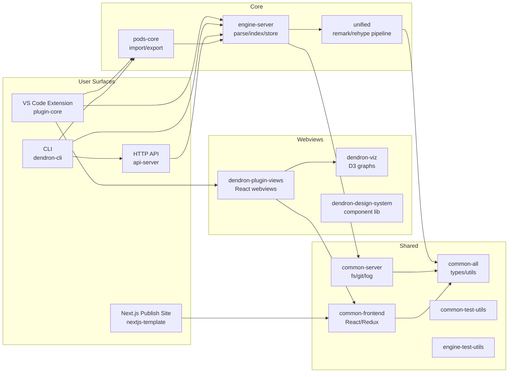

# Dendron — SME Context

> Single source of truth for AI agents working in this repository. Keep this document current as the architecture evolves.

---

## 1. What This Project Is

**Dendron** is an open-source, local-first, markdown-based **Personal Knowledge Management (PKM)** tool, delivered primarily as a **VS Code / VSCodium extension** plus supporting libraries, a CLI, an HTTP API server, and a Next.js static publishing template.

- Repo: [github.com/dendronhq/dendron](https://github.com/dendronhq/dendron)
- Branch in use: `master` (default)
- Monorepo version: `0.124.0` (see [lerna.json](lerna.json))
- Status: **Maintenance only** — active development has ceased (see the project's GitHub Discussions banner). Bug-fix mindset; avoid speculative refactors.

Dendron's selling point is that retrieval scales to 10k+ notes via a hierarchical naming scheme (dot-separated, e.g. `dev.design.engine.md`), schemas, lookup, refactor-aware links, and a publishable static site.

## 2. Why This Project Exists

PKM tools fall over past ~10k notes. Dendron treats your knowledge base like a codebase: hierarchical names, schemas (like types), refactor tooling that preserves links, plaintext storage in Git, IDE-grade UX. Mission: *"help humans organize, find, and work with any amount of knowledge."*

Design principles: **Developer-centric**, **Gradual structure**, **Flexible and consistent**.

## 3. Domain Knowledge / Terminology

| Term | Meaning |
|---|---|
| **Note** | A single `.md` file. File name is the hierarchical id (`foo.bar.baz.md`). |
| **Hierarchy** | Dot-delimited parents (`foo` → `foo.bar` → `foo.bar.baz`). |
| **Vault** | A Git-backed folder containing notes. A workspace can mount multiple vaults. |
| **Workspace** | A VS Code workspace containing one or more vaults plus `dendron.yml`. |
| **Schema** | YAML rules constraining hierarchy shapes, templates, and lookup hints. |
| **Lookup** | Unified create+find UI. The core navigation primitive. |
| **Note Reference** | `![[foo.bar]]` — transcludes another note (or block) inline. |
| **Wiki Link** | `[[foo.bar]]` — link to another note by hierarchical id. |
| **Backlink** | Reverse index of incoming wiki links / refs. |
| **Pod** | Import/export adapter for an external system (Markdown, Notion, Airtable, GitHub, Google Docs, Graphviz, Next.js). Lives in `pods-core`. |
| **Seed** | A redistributable vault you can pull into a workspace. |
| **Engine** | The in-process service that owns parse/index/query/write of notes and schemas. |
| **dendron.yml** | Per-workspace config: vaults, publishing, lookups, dev flags. |
| **Trait** | Custom note behavior plug-in (templates, on-create logic). |

## 4. System Architecture



**Data flow** (typical edit): VS Code save → `fileWatcher` in plugin-core → `engine-server` reparses the note via the `unified` pipeline → in-memory note dict + SQLite cache updated → tree/backlinks views refreshed → optional Pod export on demand.

## 5. Codebase Map

Top-level layout (see [package.json](package.json) workspaces and [lerna.json](lerna.json)):

### packages/

| Package | Role | Type |
|---|---|---|
| [common-all](packages/common-all) | Shared types, utils, logger, env, config, schema, vault, dnode, parse, analytics. Zero internal deps. | Node lib |
| [common-assets](packages/common-assets) | CSS/LESS build pipeline (gulp + postcss). | Build artifact |
| [common-server](packages/common-server) | Server-side fs (`fs-extra`), git (`simple-git`), `pino` logging, Sentry, YAML, templates. | Node lib |
| [common-frontend](packages/common-frontend) | React + Redux + AWS Amplify integration for browser surfaces. | React lib |
| [common-test-utils](packages/common-test-utils) | Test fixtures and helpers (private). | Test lib |
| [engine-server](packages/engine-server) | **Core engine.** `DendronEngineV3.ts` is the current engine; `engineClient.ts` is the client wrapper; stores, drivers, migrations, doctor, backfill, seed. | Node lib |
| [engine-test-utils](packages/engine-test-utils) | Mock engines, integration fixtures (private). | Test lib |
| [unified](packages/unified) | Markdown pipeline: `remark` + `rehype` + Mermaid + KaTeX + wiki links + note refs + decorations. | Node lib |
| [pods-core](packages/pods-core) | Pluggable import/export: Markdown, JSON, Notion, Airtable, Google Docs, GitHub Issues, Graphviz, Next.js. | Node lib |
| [api-server](packages/api-server) | Express HTTP server wrapping the engine; OAuth, CORS, `launchv2()` entry. | HTTP server |
| [dendron-cli](packages/dendron-cli) | `yargs`-based CLI. Bins: `dendron-cli`, `dendron`. Used by `yarn dendron …` and CI. | CLI |
| [plugin-core](packages/plugin-core) | **VS Code extension** (`displayName: dendron`, publisher `dendron`, activates on `*`). Main: `out/src/extension.js`, web build: `dist/web/extension.js`. | VS Code ext |
| [dendron-plugin-views](packages/dendron-plugin-views) | React webviews shown inside the extension (Antd, Cytoscape). Webpack bundle. | Webview bundle |
| [dendron-viz](packages/dendron-viz) | D3 visualizations (graph view, hierarchy). | React lib |
| [dendron-design-system](packages/dendron-design-system) | TSDX-built React component library with Storybook. | NPM lib |
| [nextjs-template](packages/nextjs-template) | Static-export Next.js 12 site used as the **publish** target. Giscus comments, GA, Playwright tests. | Next.js app |
| [generator-dendron](packages/generator-dendron) | Yeoman generator for scaffolding workspaces. | Yeoman gen |
| [_pkg-template](packages/_pkg-template) | Template used when creating a new internal package. | Template |

### Top-level

| Path | Purpose |
|---|---|
| [bootstrap/](bootstrap) | Build, publish, and dev-setup orchestration. `scripts/buildAll.js`, `scripts/buildAllForTest.js`, `scripts/buildPatch.sh`, `scripts/buildNightly.sh`, `scripts/cleanup.sh`, `scripts/genMeta.js`. `backend/updateDendronhqDeps.js` syncs internal versions. `data/verdaccio/` is the local npm registry config used for `PUBLISH_ENDPOINT=local`. |
| [hooks/](hooks) | Husky-driven `pre-commit.js` (lint-staged + format) and `pre-push.js` (typecheck/test gates). |
| [docs/](docs) | The Dendron docs site, itself a Dendron vault (`dendron.yml`). Deploys via AWS Amplify (`amplify.yml`). |
| [vendor/](vendor) | `dendron-remark-math/` — vendored remark math plugin fork. |
| [test-workspace/](test-workspace) | Integration test workspace: sample vaults, custom CSS, schemas, dependencies. Used by plugin-core e2e tests. |
| [shell/](shell) | Setup scripts that verify Node/NVM/yarn/npm versions. Entry: `shell/setup.sh`. |
| [templates/](templates) | Jinja2 / `.d.ts` templates consumed by generators. |
| [playbooks/](playbooks) | Internal automation playbooks (e.g. `addTypes.yml`). |
| [logs/](logs), [reports/](reports) | Local-only outputs (test logs, build hash reports). Not source. |
| [dev/](dev) | Internal dev/release runbooks (`dev.md`, `dev.t.changelog.md`). |

## 6. Key Design Decisions and Rationale

- **Monorepo via lerna + yarn workspaces**, `npmClient: yarn`, `useWorkspaces: true`. Versions are kept in lockstep (`lerna publish`).
- **TypeScript 4.6** pinned at the root. Each package has `tsconfig.build.json` for emitted output and `tsconfig.json` for editor.
- **`common-all` is the foundation** — never depend on it circularly. If you need a type usable in both browser and node, it goes here.
- **Engine v3 is current** (`DendronEngineV3.ts`); v2 (`enginev2.ts`) is legacy. Prefer V3 paths; don't extend V2 unless wiring legacy migration code.
- **Unified pipeline owns all markdown parsing.** Don't reach into `remark` directly from plugin/engine code — go through `@dendronhq/unified` so wiki-link/note-ref semantics stay consistent.
- **Pods are the only sanctioned external-IO extension surface.** New importers/exporters belong in `pods-core`, not engine-server.
- **Webviews are React + Antd**, hosted by `dendron-plugin-views`, bundled with Webpack, communicating with the extension host via a typed message bus.
- **Verdaccio for local releases.** `PUBLISH_ENDPOINT=local` + `USE_IN_MEMORY_REGISTRY=1` lets CI test the full publish pipeline without touching the real registry.
- **Conventional commits** drive changelog via `@dendronhq/conventional-changelog-dendron`.
- **Project is in maintenance mode** — bias toward minimal, targeted patches.

## 7. Build / Setup / Common Commands

All commands run from the repo root unless noted.

```sh
# First-time setup (installs, gen meta, builds, chmods CLI)
yarn setup

# Pieces of setup
yarn bootstrap:bootstrap   # yarn install + gen:meta
yarn bootstrap:build       # build all packages
yarn bootstrap:build:fast  # build minimum graph to run CLI/plugin
yarn bootstrap:build:plugin-core   # single package (uses lerna --scope)

# Watch a single package (must export $pkg first, e.g. export pkg=@dendronhq/engine-server)
yarn watch

# Lint / format / typecheck
yarn lint
yarn format
yarn lerna:typecheck

# Tests
yarn test                       # all jest (LOG_LEVEL=error)
yarn test:cli                   # non-plugin projects
yarn test:cli:update-snapshots  # -u
yarn ci:test:plugin             # plugin-core (VS Code extension tests)
yarn ci:test:plugin-web         # web-bundled plugin in browser
yarn ci:test:template           # Next.js Playwright tests

# CLI
yarn dendron <command>                     # via node packages/dendron-cli/lib/bin/dendron-cli.js
yarn gen:data                              # regenerate dendron.yml JSON schema (VS Code task: "generate JSON schema")

# Build/publish pipelines (drive UPGRADE_TYPE + PUBLISH_ENDPOINT envs)
yarn build:patch:local           # local verdaccio
yarn build:patch:local:ci        # CI variant with in-memory registry
yarn build:patch:remote          # publish to real registry
yarn build:minor:local|remote
yarn build:prerelease:local|remote
yarn build:patch:local:ci:nightly

# Misc
yarn cleanup                              # ./bootstrap/scripts/cleanup.sh
yarn backend:updateDendronDeps            # sync @dendronhq/* internal versions
```

VS Code tasks (from this workspace):
- `npm: generate JSON schema` → `yarn gen:data`
- `shell: test:watch` → `yarn test ${relativeFile} --watch --bail -u` with `LOG_LEVEL=info`, `LOG_DST=${workspaceFolder}/engine-test-utils.log`

Code-workspaces for focused dev: [dendron-cli.code-workspace](dendron-cli.code-workspace), [dendron-main.code-workspace](dendron-main.code-workspace), [dendron-plugin.code-workspace](dendron-plugin.code-workspace), [dendron-lsp.code-workspace](dendron-lsp.code-workspace).

## 8. Configuration Reference

- **`dendron.yml`** — per-workspace config; JSON Schema is generated by `yarn gen:data` from TS types in `common-all`. Example in [test-workspace/dendron.yml](test-workspace/dendron.yml).
- **`dendronrc.yml`** — user-level overrides (see [test-workspace/dendronrc.yml](test-workspace/dendronrc.yml)).
- **TypeScript**: root `tsconfig.json` + per-package `tsconfig.build.json`.
- **ESLint**: airbnb + prettier + jest + react. Root `.eslintrc` (see devDeps).
- **Prettier**: [prettier.config.js](prettier.config.js).
- **Jest**: [jest.config.js](jest.config.js) defines multiple `projects` (plugin vs non-plugin) — used by `--selectProjects non-plugin-tests`.
- **Babel**: [babel.config.js](babel.config.js).
- **Husky**: `pre-commit` → stash unstaged → lint-staged (prettier+eslint) → `hooks:pre-commit` → pop. `pre-push` → `hooks:pre-push`.
- **Resolutions / overrides**: pinned `trim: 0.0.3`, `d3-color: 3.1.0` to dodge known transitive issues.
- **Node engine**: `>=0.14` declared (loose); in practice use the version validated by `shell/_verify_node_version.sh`.

## 9. Observability

- **Logging**: `pino` (server/CLI). Set `LOG_LEVEL` (`error`/`info`/`debug`) and `LOG_DST` (file path or `stdout`).
- **Error reporting**: `@sentry/node` in `common-server`.
- **Analytics**: `analytics.ts` in `common-all`; A/B testing scaffolding via `abTesting.ts` / `abTests.ts`.
- **Telemetry (VS Code)**: `packages/plugin-core/src/telemetry/`. Honors user opt-out.

## 10. Common Gotchas

- **Don't `npm install`** — yarn workspaces only. Use `yarn` at root; `lerna add` for cross-package wiring.
- **Build order matters.** If you edit `common-all`, rebuild it (or run `yarn watch` with `$pkg`) before downstream tests pass.
- **Engine V2 vs V3**: V3 is the source of truth. New work goes there.
- **Webview ↔ extension** communicates via typed message contracts in `common-all`/`dendron-plugin-views`. Don't bypass them.
- **`activationEvents: ["*"]`** — the VS Code extension activates on every window. Keep startup cost low.
- **Test workspaces** must not be committed with stateful changes (`.dendron.*.json` caches). Use `test-workspace/` as fixture only.
- **CI publishes through Verdaccio.** If `build:*:local:ci` fails with registry errors, ensure no stale verdaccio process is running and `bootstrap/data/verdaccio/storage` is clean.
- **Pre-commit stash dance** can leave a hanging stash if it crashes mid-run; check `git stash list` if commits behave oddly.

## 11. How to Make Changes

1. Identify the **owning package** from the table in §5 (engine concern → `engine-server`; markdown semantics → `unified`; UI command → `plugin-core`; external integration → `pods-core`).
2. Run the watcher on that package: `pkg=@dendronhq/<name> yarn watch`.
3. Add or update tests in the matching `__tests__/` (or its `engine-test-utils` fixture for engine).
4. Run `yarn test:cli` (CLI/engine) or `yarn ci:test:plugin` (VS Code).
5. Run `yarn lerna:typecheck` to catch cross-package type breakage.
6. Conventional commit message (e.g. `fix(engine): handle empty vault`). Husky enforces lint/format.

## 12. Relationships and Dependencies

Internal dependency DAG (simplified):

```
common-all  ← everything
common-server  ← engine-server, api-server, common-test-utils, pods-core, dendron-cli
common-frontend  ← dendron-plugin-views, nextjs-template
unified  ← engine-server, pods-core, plugin-core
engine-server  ← api-server, dendron-cli, plugin-core, pods-core, dendron-viz, engine-test-utils
pods-core  ← dendron-cli, plugin-core
api-server  ← dendron-cli, engine-test-utils, plugin-core
dendron-plugin-views  ← plugin-core
dendron-viz  ← plugin-core, dendron-cli
```

Notable external deps: `unified`/`remark`/`rehype` family, `sqlite3` (engine cache), `chokidar` (file watcher), `pino`, `simple-git`, `fs-extra`, `yargs`, `prompts`, `express`, `next`, `react`, `antd`, `d3`, `cytoscape`, `@notionhq/client`, `airtable`, `googleapis`, `@octokit/graphql`, `axios`, `lodash`, `luxon`, `zod`.

## 13. Testing and Validation

- **Framework**: Jest 28, organized into projects in [jest.config.js](jest.config.js). Plugin tests run in the VS Code test host (`@vscode/test-electron`).
- **CLI/engine**: `yarn test:cli` (`--selectProjects non-plugin-tests --forceExit`).
- **Plugin**: `yarn ci:test:plugin` (electron host); web variant: `yarn ci:test:plugin-web`; perf: `yarn ci:test:plugin-perf`.
- **Next.js**: Playwright via `yarn ci:test:template` (or dockerized `ci:test:template:docker`).
- **Snapshots**: `yarn test:cli:update-snapshots` (`-u`). Be deliberate — snapshot diffs are reviewed.
- **Watch single file**: VS Code task `test:watch` uses `${relativeFile}` and writes logs to `engine-test-utils.log` at the repo root.

## 14. Release / Version State

- Current monorepo version: **0.124.0** (lerna).
- Release flows live in `bootstrap/scripts/buildPatch.sh` and `buildNightly.sh`. Env-driven: `UPGRADE_TYPE` ∈ {`patch`,`minor`,`prerelease`}, `PUBLISH_ENDPOINT` ∈ {`local`,`remote`}, `BUILD_ENV=ci`, `USE_IN_MEMORY_REGISTRY=1`.
- Changelog preset: `@dendronhq/conventional-changelog-dendron`.
- Project is **maintenance-only**; new feature work is out of scope per the upstream announcement.

## 15. Quick Reference

| Need | Command / Path |
|---|---|
| Install + build everything | `yarn setup` |
| Run CLI locally | `yarn dendron <cmd>` |
| Regenerate `dendron.yml` schema | `yarn gen:data` |
| Watch one package | `pkg=@dendronhq/engine-server yarn watch` |
| Run all non-plugin tests | `yarn test:cli` |
| Run plugin tests | `yarn ci:test:plugin` |
| Lint | `yarn lint` |
| Typecheck all | `yarn lerna:typecheck` |
| Clean | `yarn cleanup` |
| Local publish (Verdaccio) | `yarn build:patch:local` |
| Engine entry (V3) | [packages/engine-server/src/DendronEngineV3.ts](packages/engine-server/src/DendronEngineV3.ts) |
| Extension entry | [packages/plugin-core/src/extension.ts](packages/plugin-core/src/extension.ts) |
| CLI entry | [packages/dendron-cli/lib/bin/dendron-cli.js](packages/dendron-cli/lib/bin/dendron-cli.js) |
| API server entry | [packages/api-server](packages/api-server) (`launchv2()`) |
| Workspace config schema source | [packages/common-all/src/config.ts](packages/common-all/src/config.ts) |
| Markdown pipeline | [packages/unified](packages/unified) |
| Pods (import/export) | [packages/pods-core](packages/pods-core) |
| Test workspace fixture | [test-workspace](test-workspace) |
| Dev runbook | [dev/dev.md](dev/dev.md) |
| Contributing | [CONTRIBUTING.md](CONTRIBUTING.md) |

---

### Maintenance Notes for This Document

- Update whenever the engine version rolls (V3 → V4), a package is added/removed, or a top-level build script changes.
- When sections drift, prefer **deleting wrong info** over leaving stale guidance.
- Keep this under ~8k tokens; push deep dives into per-topic notes alongside this file.
