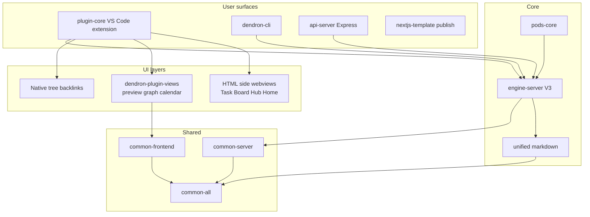

# Dendron Personal Fork — AI Context

> **Canonical orientation for AI agents.** Pair with [spec.md](./spec.md) before coding.
>
> Updated: **2026-07-24** · Monorepo **0.124.0** · Branch **`main`**  
> Backlog: [backlog.md](./backlog.md) · [docs/dev/BACKLOG.md](../../docs/dev/BACKLOG.md)  
> Product: [docs/dev/PRODUCT-ROADMAP.md](../../docs/dev/PRODUCT-ROADMAP.md)

---

## 1. What this project is

**Dendron** is a local-first, markdown **PKM** system: hierarchical notes, multi-vault workspaces, schemas, lookup, graph, publish stack, CLI, and HTTP API.

This repository is a **personal long-term maintenance fork** of `dendronhq/dendron` (upstream is maintenance-only / inactive).

| Fact | Value |
|------|--------|
| Goal | Daily-use **VS Code extension** on modern Node/VS Code |
| Not goals | Publishing `@dendronhq/*` to npm, merging upstream, marketplace release |
| Primary surface | `packages/plugin-core` — extension host |
| Config | Per-workspace `dendron.yml` |
| Version | `0.124.0` (lerna lockstep) |

Success = monorepo builds → **F5** (or local `.vsix`) → reliable personal vault workflows.

---

## 2. Domain terminology

| Term | Meaning |
|------|---------|
| **Note** | One `.md` file; basename is the hierarchical id (`foo.bar.md`) |
| **Hierarchy** | Dot parents (`foo` → `foo.bar`) |
| **Vault** | Folder of notes (often git-backed); workspace may have many |
| **Workspace** | VS Code folder(s) + `dendron.yml` |
| **Schema** | YAML hierarchy / template rules |
| **Lookup** | Create+find QuickPick — primary navigation |
| **Wiki link** | `[[foo.bar]]` |
| **Note ref** | `![[foo.bar]]` transclusion |
| **Backlink** | Reverse link index |
| **Task note** | Note with task frontmatter (`TaskNoteUtils`) |
| **Pod** | Import/export adapter (`pods-core`) |
| **Engine** | Parse / index / query / write notes + schemas |
| **Vault focus** | Workspace-scoped filter: only one vault “in scope” for rituals/lookup/tree/board |
| **Workmode** | Named preset (name + optional vault focus) |
| **Smart reload** | Incremental disk reconcile vs full `engine.init()` |

---

## 3. Architecture (current)


```mermaid
flowchart TB
  subgraph surfaces [User surfaces]
    VSC[plugin-core VS Code extension]
    CLI[dendron-cli]
    API[api-server Express]
    NEXT[nextjs-template publish]
  end

  subgraph ui [UI layers]
    HTML[HTML side webviews<br/>Task Board Hub Home]
    REACT[dendron-plugin-views<br/>preview graph calendar]
    NATIVE[Native tree backlinks]
  end

  subgraph core [Core]
    ENG[engine-server V3]
    UNI[unified markdown]
    PODS[pods-core]
  end

  subgraph shared [Shared]
    CA[common-all]
    CS[common-server]
    CF[common-frontend]
  end

  VSC --> HTML
  VSC --> REACT
  VSC --> NATIVE
  VSC --> ENG
  CLI --> ENG
  API --> ENG
  REACT --> CF
  ENG --> UNI
  ENG --> CS
  UNI --> CA
  CS --> CA
  CF --> CA
  PODS --> ENG
```

**Typical edit path:** editor save → `TextDocumentService` / `FileWatcher` → `engine.writeNote({ metaOnly })` → Fuse/meta update → tree/backlinks refresh.

**External edit path (2026-07):** `FileWatcher.onDidChange` (debounced) reindexes changed `.md` via same `metaOnly` write path. Create/delete already did.

---

## 4. Dual-build model (critical)

| Path | Output | Used by |
|------|--------|---------|
| **TypeScript compile** | `packages/plugin-core/out/src/extension.js` | **F5 / daily dev** (`package.json` `"main"`) |
| **Webpack** | `packages/plugin-core/dist/extension.js` | Packaging / `.vsix` |
| **plugin-views webpack** | `dendron-plugin-views/build/static/...` | Preview, graph, calendar React bundles |
| **HTML webviews** | Inline HTML in host | Task Board, Dendron Home — **no CRA bundle** |

```bash
# Daily extension work (what F5 loads)
yarn workspace @dendronhq/common-all build   # if types/utils changed
yarn workspace @dendronhq/plugin-core compile
# then F5 or Reload Window

# Packaging
cd packages/plugin-core && yarn webpack:prod   # SKIP_SENTRY=1 if no Sentry token
```

Docs: [docs/dev/DEV-EXTENSION.md](../../docs/dev/DEV-EXTENSION.md).  
**Never assume F5 uses `dist/`** unless `main` is changed.

---

## 5. Package map

| Package | Role |
|---------|------|
| **common-all** | Types, config, vaults, notes, TaskNoteUtils, view keys, pure utils — **foundation** |
| **common-server** | fs, git, logging, YAML, file2Note |
| **common-frontend** | Redux engine/ide slices for webviews |
| **engine-server** | `DendronEngineV3`, stores, doctor, metadata service |
| **unified** | remark/rehype pipeline, wiki links, mermaid, decorations |
| **api-server** | Express; `workspace/sync` (meta-only bodies for webviews) |
| **dendron-cli** | `yarn dendron …`; includes **`health`** system doctor |
| **plugin-core** | Extension host, commands, native views, HTML webviews, services |
| **dendron-plugin-views** | React webviews (Antd, Cytoscape graph) |
| **pods-core** | Import/export pods |
| **engine-test-utils** / **common-test-utils** | Test fixtures |

---

## 6. Product features shipped (this fork)

### Platform / modernization

- TypeScript **7**, Babel **8**, webpack **5.109**, React **19**, antd **6**, yargs **18**
- Privacy-first telemetry; `yarn dendron health` CLI doctor
- Dual-build docs; `SmartReloadService` + Reload Index smart path
- FileWatcher **onDidChange** for external edits
- Webview payload diet (meta sync, strip bodies, schema graph no full sync, lazy mermaid)
- Graph: local-first defaults, size-aware Euler, vault focus → graph vault filters
- `@sentry/webpack-plugin` v5 factory API for `webpack:prod`

### Product sprints 1–5 + awesome wave (COMPLETE as of 2026-07-24)

| Area | Commands / surfaces | Key files |
|------|---------------------|-----------|
| Quiet / perf | Quiet mode, perf status, lazy activation | `utils/quietMode.ts`, activation utils |
| Hub | Dendron Hub QuickPick | `DendronHubCommand.ts` |
| Capture | Capture to inbox | `CaptureInboxCommand.ts` |
| Process inbox | Triage bullets → note/task/journal/dismiss | `ProcessInboxCommand.ts` |
| Review | Review ritual + `lastReviewed` | `ReviewRitualCommand.ts` |
| Tasks | Create task, **Task Board editor + sidebar** | `TaskBoardCommand`, `TaskBoardPanelFactory`, `TaskBoardWebview`, `taskBoardShared` |
| Home | **Dendron Home** sidebar | `HubHomeWebview.ts` |
| Vault focus / workmodes | Scope rituals + lookup + tree + board + graph | `WorkspaceModesService`, `VaultFocusCommand`, `WorkmodeCommand` |
| Note history | Back/forward stack | `NoteHistoryService`, `NoteHistoryCommand` |
| Safe bulk rename | Preview plan + pure planner tests | `SafeBulkRenameCommand`, `safeBulkRenamePlan` |
| Extract tasks | Open bullets → task notes | `ExtractTasksFromNoteCommand`, `noteBodyUtils` |
| Workspace health (UI) | Markdown dashboard | `WorkspaceHealthCommand` |
| Local AI | Opt-in Ollama-compatible endpoint | `LocalAIAssistCommand` (`llama3.2` default model) |
| Smart reload | Incremental mtime reconcile | `SmartReloadService`, `ReloadIndex` |

**View IDs:** `dendron.task-board`, `dendron.hub-home` (sidebar); editor panel id `dendron.taskBoardEditor`.

---

## 7. Key services & patterns

| Service | Role |
|---------|------|
| `WorkspaceModesService` | Vault focus + workmodes; `filterNotesByFocus`, `onFocusChange`, `resolveWriteVault` |
| `SmartReloadService` | Disk walk → metaOnly write/delete → optional `updateIndex` |
| `NoteHistoryService` | Navigation stack (editor + preview) |
| `FileWatcher` | create / **change** / delete → metaOnly engine updates |
| `safeBulkRenamePlan` | Pure planner (unit-tested without VS Code) |
| `noteBodyUtils` | Pure bullet extract / slug / chat parse / offline AI scaffold |
| `taskBoardShared` | Shared kanban load + HTML + message handling |

**HTML webviews** (preferred for new simple UI): implement `WebviewViewProvider` or `createWebviewPanel`, inject HTML using VS Code CSS vars (`--vscode-editor-foreground`, etc.). No React required.

**React webviews**: `dendron-plugin-views` + `WebViewUtils` + message enums in `common-all` (`DMessageEnum`, `GraphViewMessageEnum`, …).

---

## 8. Commands cheat sheet (fork additions)

| Command key | Title (approx) |
|-------------|----------------|
| `dendron.showHub` | Dendron Hub |
| `dendron.captureInbox` | Capture Inbox |
| `dendron.processInbox` | Process Inbox |
| `dendron.reviewRitual` | Review Ritual |
| `dendron.taskBoard` | **Task Board (editor kanban)** |
| `dendron.vaultFocus` | Vault Focus |
| `dendron.workmode` | Workmodes |
| `dendron.extractTasksFromNote` | Extract Tasks from Note |
| `dendron.workspaceHealth` | Workspace Health |
| `dendron.localAIAssist` | Local AI Assist |
| `dendron.noteHistoryBack` / `Forward` | Note History |
| `dendron.safeBulkRename` | Safe Bulk Rename |
| `dendron.reloadIndex` | Reload Index (smart preferred) |

Settings: `dendron.localAI.enabled`, `dendron.localAI.endpoint`, `dendron.localAI.model` (default `llama3.2`).

---

## 9. Toolchain & verify

```bash
# Daily
yarn verify:local
yarn workspace @dendronhq/plugin-core compile

# After common-all / views logic
yarn workspace @dendronhq/common-all build
yarn workspace @dendronhq/dendron-plugin-views run build:dev   # React webviews only

# Health / smoke
yarn dendron health --verbose
yarn test:doctor:smoke    # may fail on Node 26 + ts-node; prefer Node 20 (.nvmrc)

# Pure helper smoke (no VS Code)
node -e "require('./packages/plugin-core/out/src/utils/noteBodyUtils.js')"
```

| Gate | Command |
|------|---------|
| Critical (this fork) | `common-all` build + `plugin-core` compile |
| Packaging | `plugin-core` `webpack:prod` (0 errors after Sentry fix) |
| Web extension | `compile-web` — still imperfect (node builtins); not required for F5 |

**Node:** prefer **20.x** (`.nvmrc`). Node 26 works for `tsc` but can break `ts-node` doctor smoke.

---

## 10. Gotchas (learned the hard way)

1. **F5 ≠ webpack.** Stale `out/` → “command not found”. Always `compile` after command changes.
2. **WebviewViewProvider** must register in the same activation turn as “initialized”; use `retainContextWhenHidden` for board/home.
3. **`onDidChangeVisibility`** is `Event<void>` — check `webviewView.visible`, not `e.visible`.
4. **exactOptionalPropertyTypes** — don’t assign `undefined` to optional props; use conditional spreads.
5. **Preview dark mode** — force VS Code CSS tokens on antd/content (theme SCSS layer).
6. **visitParents** — use named ESM-compatible imports / `unified/compat/unist`.
7. **Payload diet** — don’t ship full `note.body` to graph/calendar; use meta / empty body.
8. **Schema graph** must not set `sync: true` on every focus (full vault re-fetch).
9. **Sentry webpack plugin v5** — call `sentryWebpackPlugin()`, not `new SentryWebpackPlugin()`.
10. **Vault focus** is not automatic everywhere — filter via `WorkspaceModesService.filterNotesByFocus` or post `focusedVault` to graph.
11. Prefer **pure modules** (`*Plan.ts`, `noteBodyUtils.ts`) + mocha/jest without VS Code host.
12. Do **not** push to remote unless the user asks.

---

## 11. Dependency DAG (simplified)

```
common-all ← almost everything
common-server ← engine-server, api-server, pods-core, dendron-cli, plugin-core
unified ← engine-server, plugin-core, pods-core
engine-server ← api-server, dendron-cli, plugin-core, pods-core
common-frontend ← dendron-plugin-views
dendron-plugin-views ← assets loaded by plugin-core WebViewUtils
```

---

## 12. Observability

- **Logging:** pino / extension Logger; `LOG_LEVEL`, `DENDRON_PERF=1`
- **Telemetry:** privacy-first; local-friendly defaults (see `docs/dev/TELEMETRY.md`)
- **Sentry:** optional; skip with `SKIP_SENTRY=1` on webpack
- **Perf:** activation reports, `PerformanceTimer`, optional status bar

---

## 13. Quick paths

| Need | Path |
|------|------|
| Extension entry | `packages/plugin-core/src/extension.ts` / `_extension.ts` |
| Workspace + view registration | `packages/plugin-core/src/workspace.ts` |
| Engine V3 | `packages/engine-server/src/DendronEngineV3.ts` |
| View keys | `packages/common-all/src/constants/views.ts` |
| Command registry constants | `packages/plugin-core/src/constants.ts` |
| Graph UI | `packages/dendron-plugin-views/src/components/graph.tsx` |
| AI agent how-to | [spec.md](./spec.md) |

---

### Maintenance of this document

- Update after every product wave (commands, views, build invariants).
- Prefer deleting wrong info over hedging.
- Deep implementation recipes live in **spec.md**; product status in **PRODUCT-ROADMAP.md**.
