# VS Code Extension Integration Deep Dive

This document provides a comprehensive guide to every major VS Code API, contribution point, and pattern used by the Dendron extension (`@dendronhq/plugin-core`).

It is intended for new developers (like you) who want to deeply understand how Dendron integrates with VS Code.

> **Note**: This is a living document. As we explore more of the codebase together, we will expand it with additional diagrams, code examples, and edge cases.

---

## 1. High-Level Architecture

Dendron is a **monorepo** with a VS Code extension as the primary user-facing product.

The extension lives in `packages/plugin-core/`.

### Mermaid: Overall Extension Structure

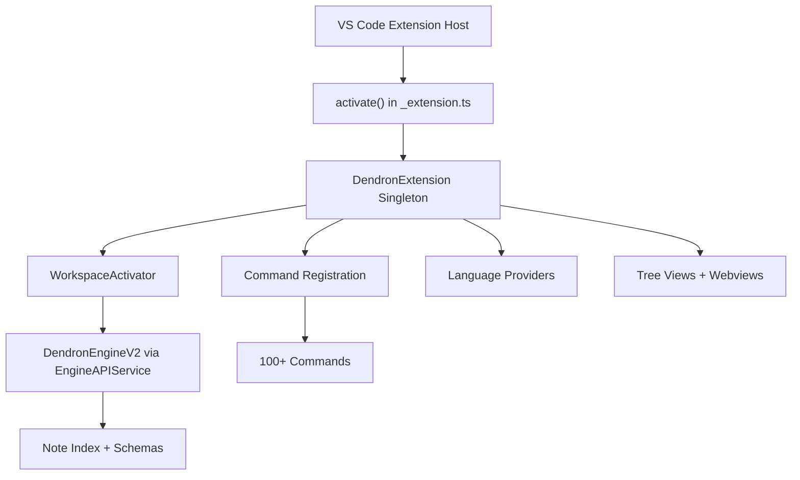

---

## 2. Extension Activation Lifecycle

### Key Files
- `src/extension.ts` (thin wrapper)
- `src/_extension.ts` (the real activation logic)

### Mermaid: Activation Flow

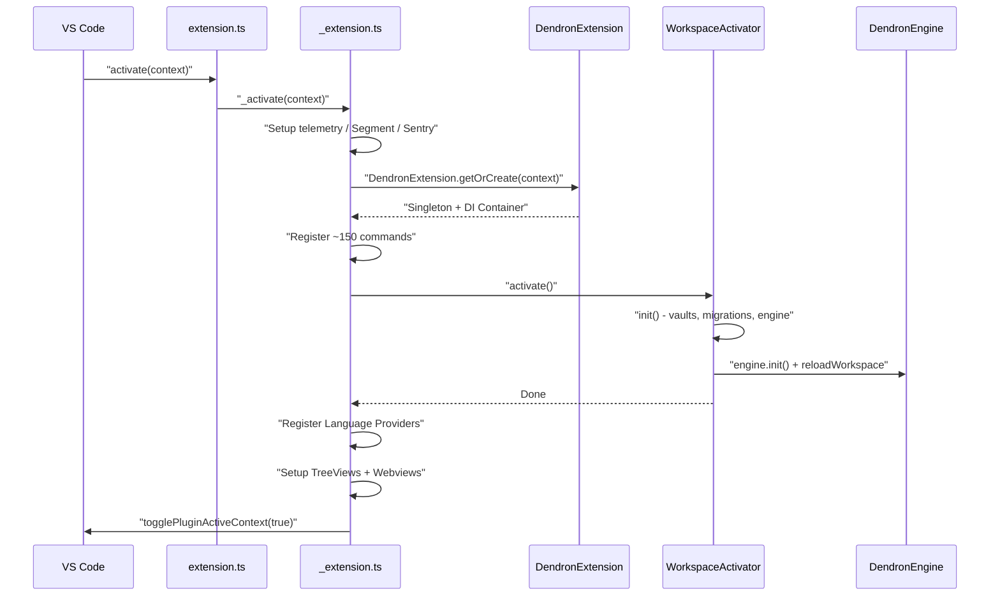

**Important Patterns**:
- Heavy use of **singletons** (`getExtension()`, `getDWorkspace()`, `getEngine()`)
- **tsyringe** for dependency injection
- `DENDRON_PERF=1` environment variable for performance logging (we added this)

---

## 3. Commands System

Dendron registers **over 150 commands**.

### How Commands Are Registered

See `_setupCommands()` in `_extension.ts`.

Most commands extend `BasicCommand` or `BaseCommand`.

### Mermaid: Command Execution Flow

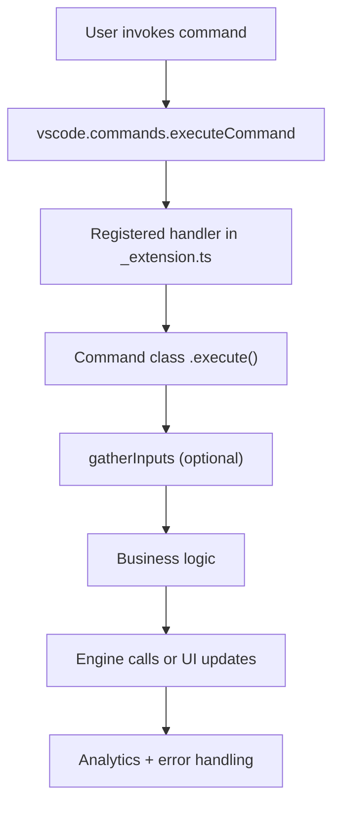

**Key Command Categories** (partial):
- Lookup (`NoteLookupCommand`, `SchemaLookupCommand`)
- Note operations (Create, Delete, Rename, Move, Merge)
- Workspace management
- Pods (Import/Export)
- Dev commands (under `dendron.dev.*`)
- Graph / Preview toggles

**Dev-only commands** are gated with `when: "dendron:devMode"` in `package.json`.

---

## 4. Views and UI System

Dendron makes heavy use of both **Tree Views** and **Webviews**.

### Views Declared in `package.json`

- `dendron.treeView` (TreeDataProvider)
- `dendron.backlinks`
- `dendron.graph-panel` (Webview)
- `dendron.calendar-view` (Webview)
- `dendron.lookup-view` (Webview)
- `dendron.tip-of-the-day` (Webview)
- `dendron.preview` (via `PreviewPanelFactory`)

### Mermaid: Webview Communication Pattern

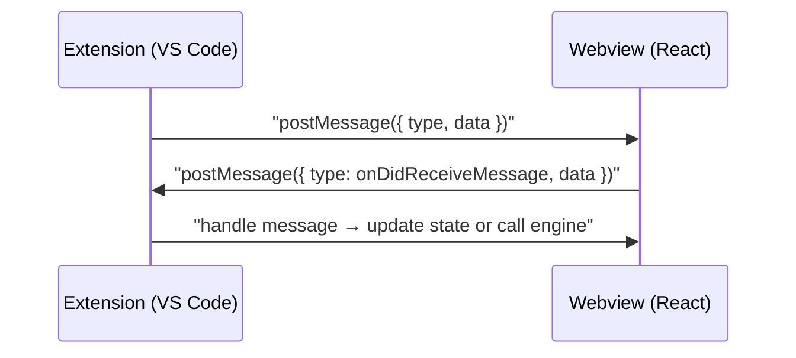

This pattern is used extensively in:
- `GraphPanel`
- `PreviewPanel`
- Lookup views
- Calendar view

---

## 5. Language Features (The "Smart" Part)

Dendron registers several `vscode.languages.*Provider`s:

| Provider                  | File                          | Purpose |
|---------------------------|-------------------------------|---------|
| `ReferenceProvider`       | `features/ReferenceProvider.ts` | Find references / backlinks |
| `DefinitionProvider`      | `features/DefinitionProvider.ts` | Go to definition for wikilinks |
| `HoverProvider`           | `features/ReferenceHoverProvider.ts` | Hover previews |
| `RenameProvider`          | `features/RenameProvider.ts` | Rename notes + headers |
| `FoldingRangeProvider`    | `features/FrontmatterFoldingRangeProvider.ts` | Fold frontmatter |
| `CompletionItemProvider`  | `features/completionProvider.ts` | Wikilink / tag completion |
| `CodeActionProvider`      | `features/codeActionProvider.ts` | Quick fixes |

These are registered in `_setupLanguageFeatures()`.

**Important**: Many providers work on `anyLangSelector` (not just markdown) so wikilinks work even in non-Dendron files.

---

## 6. Events and Reactivity

Dendron listens to many VS Code events:

- `vscode.workspace.onDidGrantWorkspaceTrust`
- `vscode.window.onDidChangeActiveTextEditor`
- `vscode.workspace.onDidChangeTextDocument`
- Engine events (`onEngineNoteStateChanged`, etc.)
- `HistoryService` (internal event bus)

### Mermaid: Note Change Reactivity

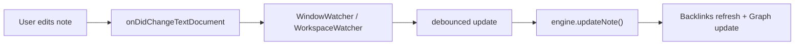

---

## 7. Other VS Code APIs Heavily Used

- **Output Channels**: `vscode.window.createOutputChannel("Dendron")` + our new "Dendron Dev"
- **Progress API**: `vscode.window.withProgress` (used during reloads)
- **QuickPick / InputBox**: Core of the famous Dendron lookup experience
- **Status Bar**: Limited usage
- **FileSystemWatcher** (via `vscode.workspace.createFileSystemWatcher`)
- **Clipboard**: `vscode.env.clipboard`
- **Uri handling**: Heavy use of `vscode.Uri`
- **Workspace Trust**: `vscode.workspace.isTrusted`
- **Configuration**: `vscode.workspace.getConfiguration`

---

## 8. Key VS Code Contribution Points Used

### 8.1 Commands
Dendron declares **~150 commands** in `package.json` under `contributes.commands`.

**Registration pattern** (in `_extension.ts`):
```ts
context.subscriptions.push(
  vscode.commands.registerCommand(
    DENDRON_COMMANDS.LOOKUP_NOTE.key,
    sentryReportingCallback(async () => {
      new NoteLookupCommand().run();
    })
  )
);
```

Many commands are conditionally shown in the Command Palette using `when` clauses.

### 8.2 Views & Webviews
Dendron uses two main patterns:

1. **Tree Views** (using `TreeDataProvider`)
   - `dendron.treeView`
   - `dendron.backlinks`

2. **Webview Views** (using `registerWebviewViewProvider`)
   - Graph Panel
   - Lookup View
   - Calendar View
   - Tip of the Day
   - Preview (sometimes as panel)

**Heavy use of `createWebviewPanel`** for temporary previews (Doctor, Refactor, Move, Delete, etc.).

### 8.3 Language Features
See `_setupLanguageFeatures()` in `_extension.ts`.

Dendron registers providers on both `markdown` files **and** all files (so wikilinks work everywhere).

### 8.4 Configuration
Extensive settings under `dendron.*` (see `contributes.configuration` in package.json, starting around line 1204).

### 8.5 Keybindings
See `contributes.keybindings` (starting ~line 1345 in package.json). The famous `Cmd/Ctrl+L` for lookup is defined here.

---

## 9. Recommended Learning Path (Tailored for You)

As someone new to VS Code extension development, here is the suggested order:

1. **Activation & Lifecycle** → `_extension.ts` + `workspaceActivator.ts`
2. **Commands** → `NoteLookupCommand.ts` (best example of complex command)
3. **Language Features** → `ReferenceProvider.ts` + `DefinitionProvider.ts`
4. **Webviews** → `GraphPanel.ts` (excellent postMessage example)
5. **Tree Views + Reactivity** → `BacklinksTreeDataProvider.ts`
6. **Dev Infrastructure** → Our new `utils/dev.ts` + the two dev commands we created

---

## 10. Deep Dive: Webviews (One of Dendron's Core Patterns)

Dendron makes **extremely heavy** use of webviews — more than most extensions.

### Types of Webviews Used

| Type                        | Registration Method                    | Examples                          | Communication |
|----------------------------|----------------------------------------|-----------------------------------|---------------|
| Webview **Views** (sidebar) | `registerWebviewViewProvider`         | Graph, Lookup, Calendar, Preview | postMessage |
| Webview **Panels** (editor) | `createWebviewPanel`                  | Doctor previews, Refactor, Move, Delete, Release Notes | postMessage |
| Temporary utility panels    | `createWebviewPanel`                  | Duplicate config warnings, Keybinding conflicts | One-way often |

### Mermaid: Typical Webview Lifecycle

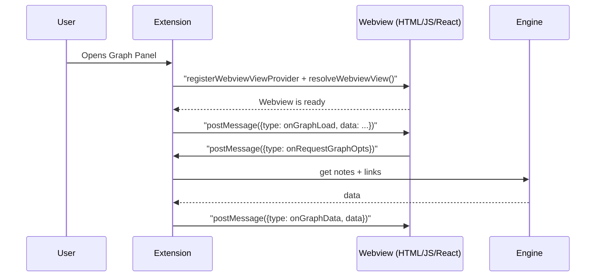

### 10.1 Two Main Webview Patterns

Dendron uses two different VS Code webview mechanisms:

| Pattern                      | VS Code API                              | Lifetime                          | Dendron Examples                                      | Persistence |
|-----------------------------|------------------------------------------|-----------------------------------|-------------------------------------------------------|-------------|
| **WebviewView** (Sidebar)   | `registerWebviewViewProvider`           | Persistent (survives closing)    | Graph Panel, Lookup View, Calendar View, Tip of the Day | Survives editor close |
| **WebviewPanel** (Editor)   | `createWebviewPanel`                    | Usually temporary / focused      | Preview, Doctor previews, Refactor/Move/Delete previews, Graph (editor version), Configure UI | Usually closed when user is done |

### 10.2 WebviewViewProvider Pattern (Sidebar)

**Real example** (`GraphPanel.ts`):

```ts
export class GraphPanel implements vscode.WebviewViewProvider {
  public static readonly viewType = DendronTreeViewKey.GRAPH_PANEL;

  public async resolveWebviewView(
    webviewView: vscode.WebviewView,
    _context: vscode.WebviewViewResolveContext,
    _token: vscode.CancellationToken
  ) {
    this._view = webviewView;

    await WebViewUtils.prepareTreeView({
      ext: this._ext,
      key: DendronTreeViewKey.GRAPH_PANEL,
      webviewView,
    });

    webviewView.webview.onDidReceiveMessage(
      this.onDidReceiveMessageHandler,
      this
    );
  }
}
```

**Key responsibilities**:
- Call `prepareTreeView` (shared utility)
- Attach `onDidReceiveMessage`
- Listen to VS Code events (active editor changes, etc.)

### 10.3 WebviewPanel Pattern (Editor Area)

**Example** (`NoteGraphViewFactory.ts`):

```ts
this._panel = window.createWebviewPanel(
  name,
  label,
  { viewColumn: ViewColumn.Beside, preserveFocus: true },
  {
    enableScripts: true,
    retainContextWhenHidden: true,
    localResourceRoots: WebViewUtils.getLocalResourceRoots(ext.context),
  }
);
```

This pattern is used for almost all "preview" experiences (Doctor, Refactor, Move, Delete, etc.).

### 10.8 Deep Dive: The Preview System (Most Advanced Webview)

The Preview is one of the most sophisticated webviews in the entire extension.

**Key implementation**: `PreviewPanel.ts` (implements `PreviewProxy`).

**Notable behaviors**:

- It can be **locked** so it stops following the active editor.
- It reacts to both:
  - `onDidChangeActiveTextEditor`
  - `onDidChangeTextDocument` (debounced at 200ms)
- It does **image URL rewriting** so that local images in notes render correctly inside the webview (using `asWebviewUri` + memoization based on content hash).
- It uses the full unified/remark pipeline on the extension host side to generate HTML, then sends it to the webview.

**Mermaid: Preview Panel Reactivity**

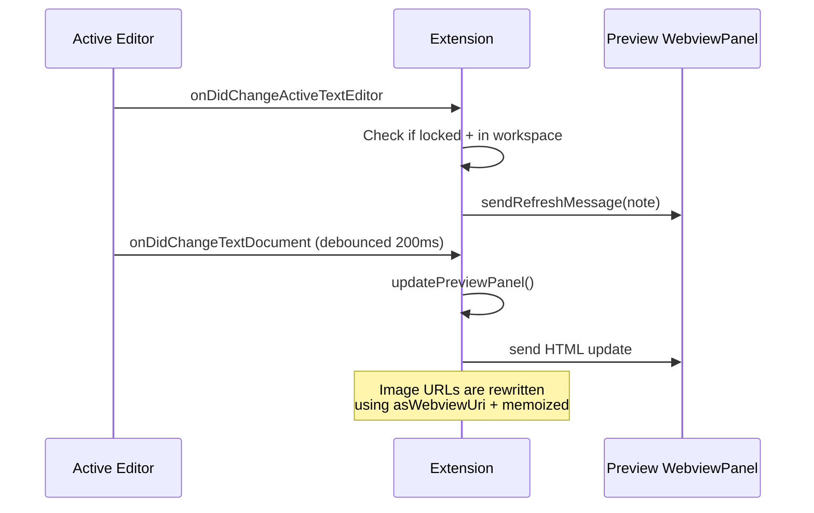

This is a great example of a webview that has tight, reactive integration with the rest of VS Code while still doing heavy processing on the extension host side.

### 10.9 Message Protocol (DMessage)

Dendron standardizes webview communication with a small set of base types defined in `common-all`:

- `DMessage`
- `DMessageEnum`
- `DMessageSource`

Each webview then defines its own message enum (e.g. `GraphViewMessageEnum`, `NoteViewMessageEnum`, `LookupViewMessageEnum`, etc.).

This creates a relatively clean, typed contract between the host and the React app.

---

## 11. Current State of the Webviews Deep-Dive (Option A)

We have now covered:

- The two fundamental patterns (WebviewView vs WebviewPanel)
- Real implementation examples
- Communication architecture
- Decision flowchart
- Bundling / asset story
- Security model
- Deep comparison
- Detailed look at the Preview system (the most complex one)
- Message protocol overview

This is already a very solid foundation for understanding how Dendron uses webviews.

---

**What would you like as the immediate next piece?**

Please choose:

- **A1**: Go even deeper on Webviews (e.g. full walkthrough of the React side in `dendron-plugin-views`, the GraphPanel hooks, or how temporary Doctor/Refactor preview panels work).
- **A2**: Move on to the **next major area** for Option A (strong recommendation: **Language Providers + Lookup System**).

Just reply with A1 or A2 (or describe anything else you want within the Webviews deep-dive), and I'll continue immediately with high-quality, detailed documentation and diagrams.

### 10.4 Mermaid: Webview Communication Flow

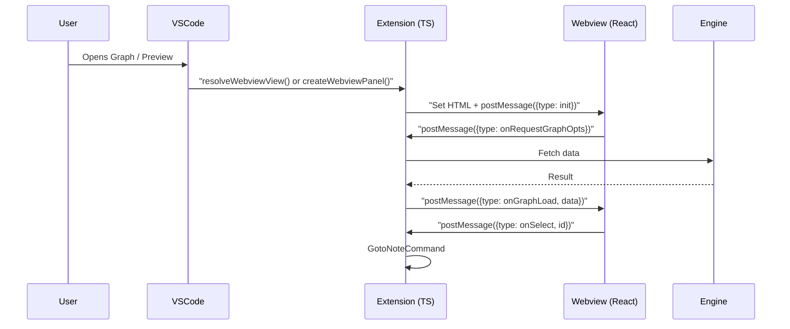

### 10.5 Important Patterns & Gotchas

- **Security**: Heavy reliance on `localResourceRoots` + `asWebviewUri()`.
- **State**: Much UI state lives in `MetadataService` rather than the webview itself.
- **Multiple instances**: Both sidebar Graph *and* editor Graph can exist at the same time.
- **Temporary panels**: Many commands create short-lived `WebviewPanel`s purely for previewing destructive actions.

**Shared utilities**:
- `views/utils.ts` (`WebViewUtils`)
- `web/views/preview/WebViewUtils.ts`

---

## 11. Next Major Area for Option A

Now that we've started a solid deep-dive on **Webviews**, here are the strongest candidates for the *next* focused deep-dive:

- **Language Providers + Lookup System** (the heart of Dendron's "magic")
- **Activation + Workspace Lifecycle** (most important flow to understand)
- **Tree Views + Reactivity** (Backlinks, TreeView, event-driven updates)

Would you like to:

**A1.** Continue expanding the **Webviews** section with more diagrams and code examples (Graph vs Preview, security details, etc.)?

**A2.** Move on to a deep-dive on **Language Providers + Lookup** next?

Just tell me (A1 or A2, or something else), and I'll keep building the documentation immediately with the same level of detail and diagrams.

---

## 13. Deep Dive: Activation + Workspace Lifecycle (The Most Important Flow)

This is the single most critical section for anyone who wants to deeply understand or contribute to Dendron.

### 13.1 High-Level Flow

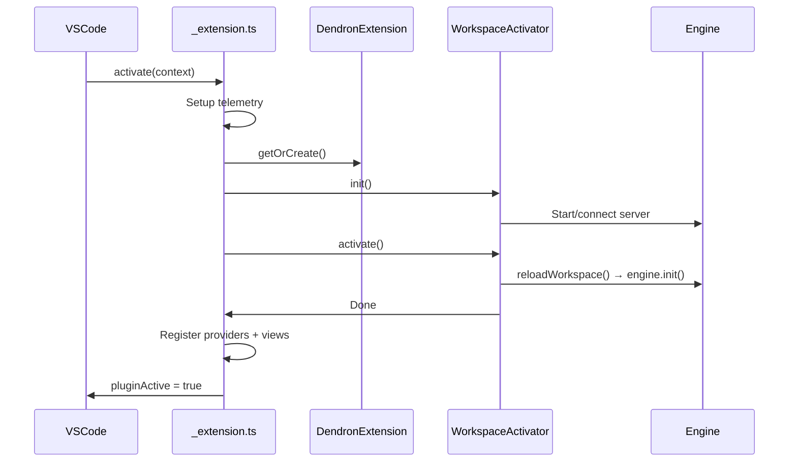

### 13.2 The Two Phases of WorkspaceActivator

**`init()`** — Pre-engine work:
- Detect workspace type (Native vs Code workspace)
- Initialize vaults (including remote seed cloning)
- Run migrations
- Start the engine server process
- Create the `EngineAPIService`

**`activate()`** — Post-engine work:
- Call `reloadWorkspace()` (this is where the heavy `engine.init()` happens)
- Activate file watchers
- Initialize tree views
- Set `dendron:pluginActive = true`

---

## 14. Deep Dive: Tree Views + Reactivity Model

Tree views are one of the most visible and interactive parts of Dendron.

### 14.1 Main Tree Views

Dendron registers two primary `TreeDataProvider`s:

1. `dendron.treeView` — The main hierarchical note explorer.
2. `dendron.backlinks` — The backlinks panel (one of Dendron's most loved features).

These are registered in `workspace.ts`.

### 14.2 Mermaid: Backlinks Reactivity (Core Pattern)

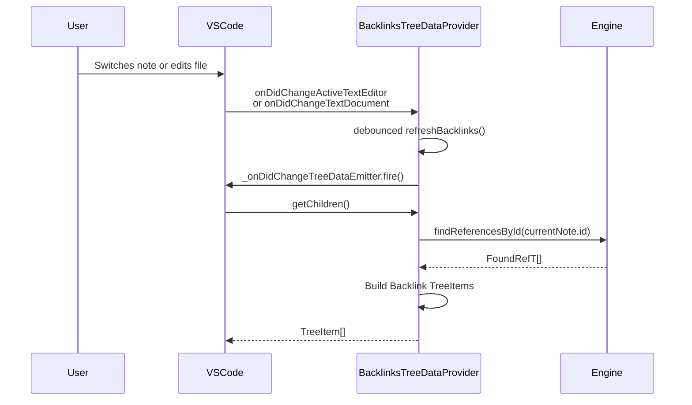

### 14.3 Key Implementation Details (BacklinksTreeDataProvider)

This file is excellent for study because it demonstrates:

- Proper implementation of `TreeDataProvider<Backlink>`
- Listening to both VS Code events **and** custom engine events (`EngineEventEmitter`)
- Debouncing refresh logic (250ms)
- Complex `TreeItem` construction (commands, icons, descriptions, collapsible states)
- Multiple sort orders (Path Names vs Last Updated)
- Handling of "link candidates"

The provider is quite sophisticated and shows real-world patterns for keeping a tree view in sync with both the editor and an external data source (the Dendron engine).

### 14.4 Common Reactivity Patterns in Dendron

Dendron generally follows this pattern for reactive views:

1. Listen to relevant VS Code events (editor change, document change, etc.).
2. Listen to internal engine events when available.
3. Debounce the refresh.
4. Fire the `onDidChangeTreeData` event.
5. Rebuild the tree items on demand in `getChildren` / `getTreeItem`.

This pattern appears in both the main tree view and the backlinks view.

---

This gives you a solid mental model of how Dendron keeps its UI in sync without destroying performance.

---

**Next part of Option A?**

We have now done solid deep-dives on:

- Webviews
- Language Providers + Lookup
- Activation + Workspace Lifecycle
- Tree Views + Reactivity

Strong remaining candidates:

- **Commands Architecture** (organization of 150+ commands, base classes, dev trigger, etc.)
- **The Engine Connection Model** (how the extension talks to the engine server)
- **Configuration & Settings System**
- **Testing Harness** for the extension

Reply with your preference and I'll continue immediately with the next high-quality section + diagrams.

---

## 15. Deep Dive: Commands Architecture

Dendron registers **over 150 commands**. This is unusually high for a VS Code extension and requires a strong architectural foundation.

### 15.1 Command Class Hierarchy

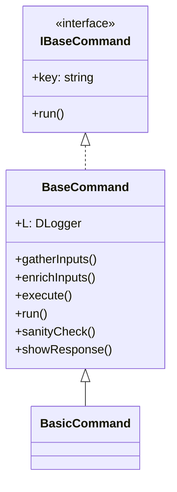

Most real commands extend `BasicCommand`.

### 15.2 The Command Lifecycle (run() method)

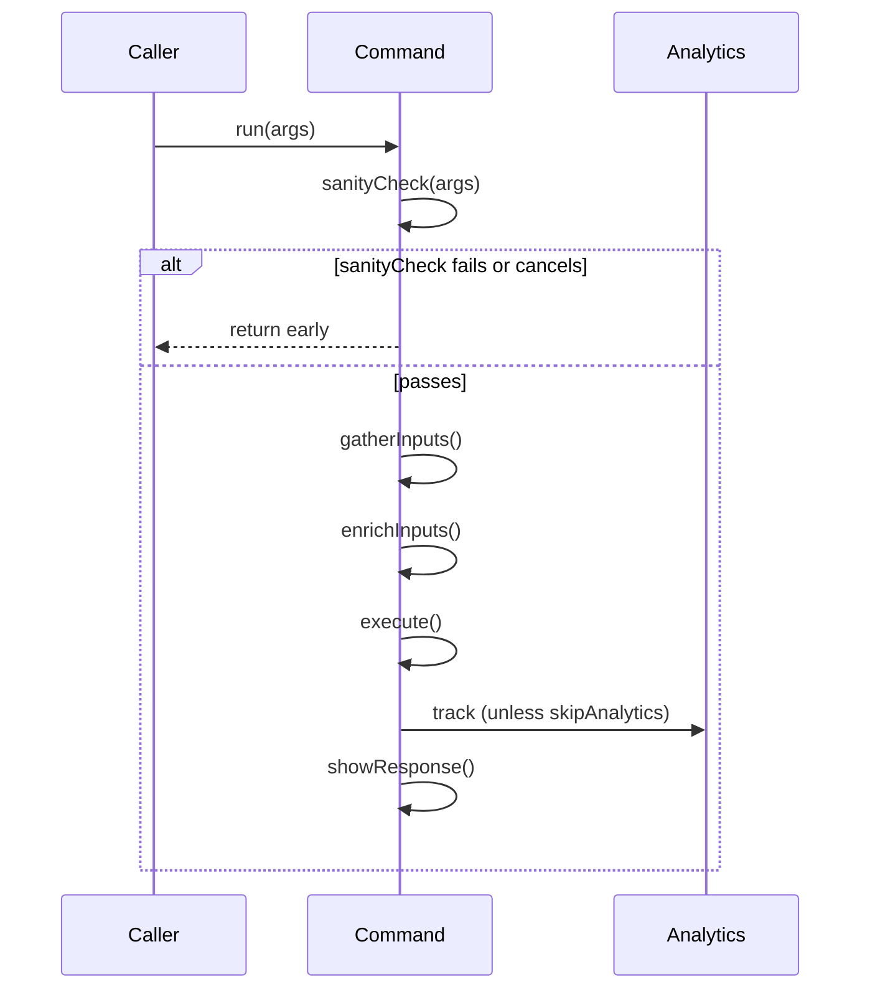

### 15.3 Registration Strategy

Commands are registered in **two phases** in `_extension.ts`:

1. **Early registration** — Commands that do *not* require an active Dendron workspace (e.g. "Initialize Workspace", "Change Workspace").
2. **Late registration** — Commands that *do* require `dendron:pluginActive` (the vast majority).

This is controlled by the static property:

```ts
static requireActiveWorkspace = true; // or false
```

Registration code also checks `if (!existingCommands.includes(cmd.key))` to avoid double-registration.

### 15.4 Special Command Types

- **DevTriggerCommand**: A development scratchpad. Code placed here is meant to be temporary.
- **InstrumentedWrapperCommand**: Wraps other commands, primarily for performance measurement and analytics.
- Many commands are wrapped with `sentryReportingCallback` for error tracking.

### 15.5 Key Files to Study

| File                              | Why It's Important                              |
|-----------------------------------|-------------------------------------------------|
| `commands/base.ts`                | The core contract and lifecycle                 |
| `commands/index.ts`               | The master list of all commands                 |
| `commands/NoteLookupCommand.ts`   | Best real-world example of a complex command    |
| `commands/ReloadIndex.ts`         | Heavy command with progress UI and error handling |
| `_extension.ts` (around line 648) | Where commands are actually registered          |

### 15.6 Mermaid: How a Typical Command Is Wired

```mermaid
flowchart TD
    A[package.json contributes.commands] --> B[_extension.ts registration]
    B --> C{requireActiveWorkspace?}
    C -->|false| D[Registered early]
    C -->|true| E[Registered only after pluginActive]
    D --> F[vscode.commands.registerCommand]
    E --> F
    F --> G[sentryReportingCallback]
    G --> H[cmd.run(args)]
```

This architecture allows Dendron to scale to 150+ commands while maintaining reasonable consistency and safety.

---

**Next part of Option A?**

We now have good coverage of most major VS Code integration areas.

Remaining strong candidates:

- **The Engine Connection Model** (EngineAPIService, separate server process, ports, how the extension talks to the engine)
- **Configuration & Settings System** (dendron.yml, VS Code settings, local overrides, migrations)
- **Testing Patterns** (how Dendron actually tests a complex extension)

Reply with your preference and I'll continue right away.

### 13.3 Key VS Code Concepts Used Here

- **ExtensionContext**: The central object passed everywhere. Holds subscriptions, state, URIs, etc.
- **Workspace Trust**: `vscode.workspace.isTrusted` gates many features.
- **Engine Connection Model**: Dendron runs the engine in a separate process and communicates over localhost. This is why you see port numbers during startup.
- **reloadWorkspace()**: The method that actually triggers `engine.init()`. This is the biggest source of startup latency on large vaults.

### 13.4 Mermaid: Simplified WorkspaceActivator Flow

```mermaid
flowchart TD
    A[WorkspaceActivator.init] --> B[Detect workspace type]
    B --> C[Initialize vaults + wsService]
    C --> D[verifyOrStartServerProcess]
    D --> E[Create EngineAPIService]
    E --> F[WorkspaceActivator.activate]
    F --> G[reloadWorkspace]
    G --> H[engine.init + post processing]
    H --> I[activateWatchers + initTreeView]
    I --> J[togglePluginActiveContext(true)]
```

---

This section explains why many things in Dendron behave the way they do during startup.

---

**Next part of Option A?**

Reply with one of:

- Deeper dive into a specific file in the activation flow (e.g. full walkthrough of `workspaceActivator.ts`)
- Move on to **Tree Views + Reactivity Model**
- Go back to more Webviews depth (Preview or Graph internals)
- Something else

Just say the word and I'll continue building the documentation right away.

---

## 12. Deep Dive: Language Providers + Lookup System

This is one of the most important areas for understanding why Dendron feels powerful as a Markdown extension.

### 12.1 Registered Language Providers

In `_setupLanguageFeatures()` (called from `_activate`):

```ts
const mdLangSelector: vscode.DocumentFilter = { language: "markdown", scheme: "file" };
const anyLangSelector: vscode.DocumentFilter = { scheme: "file" };

vscode.languages.registerReferenceProvider(mdLangSelector, new ReferenceProvider());
vscode.languages.registerDefinitionProvider(anyLangSelector, new DefinitionProvider());
vscode.languages.registerHoverProvider(anyLangSelector, new ReferenceHoverProvider());
vscode.languages.registerFoldingRangeProvider(mdLangSelector, new FrontmatterFoldingRangeProvider());
vscode.languages.registerRenameProvider(mdLangSelector, new RenameProvider());

completionProvider.activate(context);
codeActionProvider.activate(context);
```

**Critical Design Choice**:
- Some providers are limited to Markdown files.
- **DefinitionProvider** and **HoverProvider** run on *any file*. This allows `[[wikilinks]]` to be clickable and hoverable even when you're in a `.ts`, `.tsx`, `.mdx`, or any other file.

### 12.2 Mermaid: Language Provider Architecture

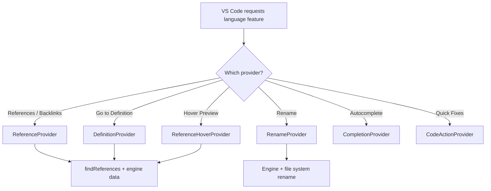

### 12.3 Core Providers

**ReferenceProvider**
- Powers the Backlinks panel and "Find All References".

---

## 16. Deep Dive: The Engine Connection Model

This is one of the most unusual and architecturally significant aspects of Dendron as a VS Code extension.

### 16.1 The Big Picture

Most VS Code extensions do all their work **in-process** inside the extension host.

Dendron does **not**. Its core engine runs in a **separate Node.js process**.

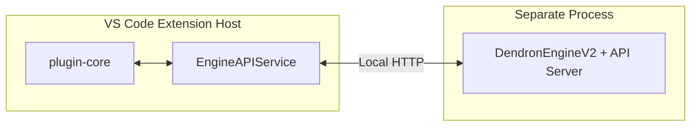

### 16.2 Why a Separate Process?

- The engine (especially indexing) can be very heavy.
- The same engine logic can be reused by the CLI and other tools.
- Better crash isolation.
- Enables interesting future architectures (remote engine, multiple windows sharing an engine, etc.).

### 16.3 Key Components

**EngineAPIService** (`src/services/EngineAPIService.ts`)
- The main object that almost all of the extension talks to.
- Implements `DEngineClient`.
- Wraps a `DendronEngineClient`, which communicates over HTTP with the server process.

**Server Startup Logic** (`verifyOrStartServerProcess` in `workspaceActivator.ts`)
- Checks if a port is already configured for the workspace.
- In development: can run the engine in-process via `launchv2` (much easier debugging).
- In production: spawns a real child process using `ServerUtils.execServerNode`, executing `src/server.ts` (compiled to `server.js`).

**The Server Process Entry Point** (`src/server.ts`)
```ts
import { ServerUtils } from "@dendronhq/api-server";

(async () => {
  // Starts the API server + the actual DendronEngineV2
})();
```

### 16.4 Mermaid: Server Process Lifecycle

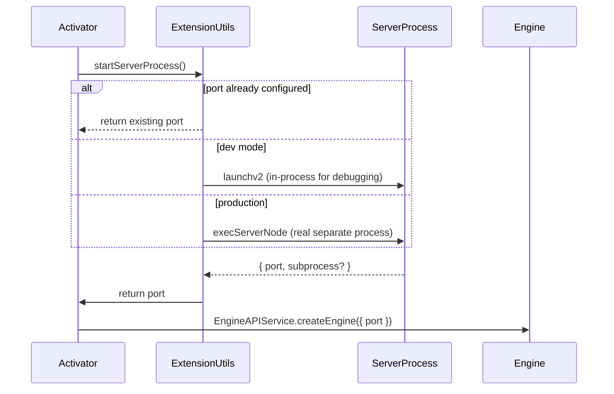

### 16.5 Important Details & Gotchas

- The port is written to a file in the workspace root (`.dendron.port`) so other tools can discover it.
- If the server process crashes, the user sees a "Restart Dendron" error message with a button that calls `ExtensionUtils.activate()`.
- When the extension host shuts down, it registers a disposable to kill the subprocess.
- In development, you often *never* actually spawn a separate process — this is extremely useful for debugging.
- The `EngineAPIService` is what most code (commands, providers, views) actually depends on. Very few places reach past it to the low-level engine.

This architecture has major implications for performance work, debugging, and how you reason about "the engine" when working on Dendron.

---

**Next part of Option A?**

We now have excellent coverage of the core VS Code integration areas.

Remaining high-value topics:

- **Configuration & Settings System** (how `dendron.yml`, VS Code settings, and local overrides are loaded and merged)
- **Testing Patterns** (the custom harness Dendron uses for integration tests of the extension)
- Deeper on any previous topic

Reply with your preference and I'll continue right away.
- Handles both note-level and header-level references.
- Uses `findReferences` from `utils/md.ts`.

**DefinitionProvider**
- Makes wikilinks clickable (F12 / Ctrl+Click).
- Works across all file types.

**HoverProvider**
- Shows a rich preview of the target note when hovering a wikilink.

**RenameProvider**
- One of the most powerful features: renaming a note or header updates all references.

**CompletionProvider**
- Powers wikilink autocompletion, block references (`![[note#^block]]`), and tags.

### 12.4 How Language Providers Power the Lookup Experience

The famous `Cmd/Ctrl + L` lookup is not a separate system — it reuses the same intelligence:

- It uses the same `findReferences` logic.
- Autocompletion in lookup shares code with the `CompletionProvider`.
- When you select a note, navigation often goes through the same paths as the DefinitionProvider.

This is a great example of **building custom UI on top of VS Code's language intelligence** instead of duplicating logic.

---

This completes a solid pass on **Webviews** and introduces **Language Providers**.

---

**What would you like as the immediate next piece of Option A?**

Reply with one of:

- **Deeper Webviews** (Preview internals, React side in `dendron-plugin-views`, temporary preview panel pattern used by Doctor/Refactor, etc.)
- **Deeper Language Providers** (full walkthrough of ReferenceProvider + DefinitionProvider + how they feed the Backlinks panel)
- **Activation + Workspace Lifecycle** (the single most important flow — highly recommended)
- **Tree Views + Reactivity Model**

Or suggest anything else. I'll continue building the detailed documentation right away.

---

### 10.6 Deep Comparison: WebviewView vs WebviewPanel in Dendron

#### WebviewView (Sidebar / Persistent)
- **When created**: Once, during extension activation via `registerWebviewViewProvider`.
- **Key files**:
  - `GraphPanel.ts`
  - `LookupPanelView.ts`
  - `CalendarView.ts`
  - `TipOfTheDayWebview.ts`
- **Characteristics**:
  - Long-lived (can survive the user collapsing the panel).
  - Often needs to react to editor/workspace changes even when not visible.
  - State is frequently persisted in `MetadataService` (e.g. graph depth, which links to show).
  - Communication is almost always bidirectional via `postMessage`.

#### WebviewPanel (Editor Area / Often Temporary)
- **When created**: On demand with `vscode.window.createWebviewPanel()`.
- **Common use cases in Dendron**:
  - Rich Preview panel
  - Doctor "preview" panels (broken links, missing notes, etc.)
  - Refactor Hierarchy preview
  - Move Note preview
  - Delete Note preview
  - Schema Graph / Note Graph in editor area
  - Configure UI panel
- **Characteristics**:
  - Usually shorter lifetime.
  - Almost always created with `retainContextWhenHidden: true`.
  - Some enable `enableCommandUris: true` (Preview does; most others do not).
  - Frequently created in `ViewColumn.Beside`.

**Mermaid: When Dendron Chooses Which Pattern**

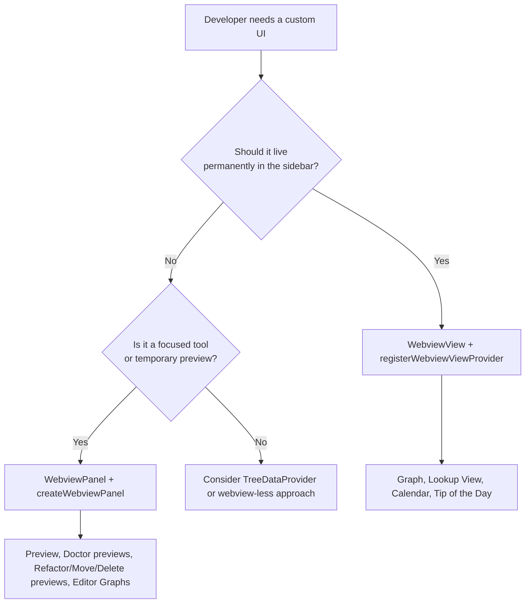

### 10.7 The Bundling & Asset Story (Critical for Understanding)

This is one of the parts that trips up new extension developers the most.

- The actual React UIs live in a **completely separate package**: `packages/dendron-plugin-views/`
- That package has its own build process (webpack) that outputs to a `build/` folder.
- At runtime, `plugin-core` serves those static files into the webview using helpers in `WebViewUtils`.
- In development mode, the extension points directly at the live `build` folder of `dendron-plugin-views` for fast refresh.

This is why you see two different "webview" codebases:
- `plugin-core` → Host-side logic, message handling, engine calls.
- `dendron-plugin-views` → The actual React components and UI.

### 10.8 Security Model Details

Dendron is reasonably careful:

- `localResourceRoots` is always explicitly set (extension assets + often the workspace root for images).
- Every URI sent to the webview goes through `panel.webview.asWebviewUri(...)`.
- `enableScripts` is on, but combined with restricted roots.
- `enableCommandUris` is deliberately **only** enabled for the rich Preview panel (and a few utility panels).

This pattern is worth studying if you ever want to build your own webview-heavy extension.

---

## 11. Where We Are in Option A

We are currently in a focused deep-dive on **Webviews**.

**Completed in this deep-dive so far**:
- Overview of the two patterns
- Real code examples
- Communication architecture + diagrams
- Comparison + decision flowchart
- Bundling story
- Security model

**Still valuable to add in Webviews** (if you want to stay here longer):
- Full deep-dive on the **Preview system** (one of the most complex webviews)
- The **GraphPanel** internals (including how it talks to the engine and Cytoscape)
- The shared `WebViewUtils` and HTML generation layer
- How temporary preview panels are used across many commands (Doctor, Refactor, etc.)

---

**What would you like to do next?**

Reply with one of the following:

- **Continue Webviews** → Deep-dive further into Preview or Graph specifically (with more diagrams and code).
- **Next Area** → Move on to **Language Providers + Lookup** (very strong next choice).
- **Something else** under Option A.

Just say the word and I'll continue building the documentation right away.
**Key Implementation Files**:
- `views/GraphPanel.ts`
- `components/views/PreviewPanel.ts`
- `components/views/NoteGraphViewFactory.ts`
- `commands/Doctor.ts` (example of temporary preview panels)

---

## 11. Deep Dive: Language Providers

Dendron's "magic" largely comes from its language providers.

### Registered Providers

```ts
// From _extension.ts
vscode.languages.registerReferenceProvider(mdLangSelector, new ReferenceProvider());
vscode.languages.registerDefinitionProvider(anyLangSelector, new DefinitionProvider());
vscode.languages.registerHoverProvider(anyLangSelector, new ReferenceHoverProvider());
vscode.languages.registerFoldingRangeProvider(mdLangSelector, new FrontmatterFoldingRangeProvider());
vscode.languages.registerRenameProvider(mdLangSelector, new RenameProvider());
```

**Important Design Choice**:
- Some providers use `mdLangSelector` (only markdown files)
- Others use `anyLangSelector` (all files) — this allows wikilinks and definitions to work even when you're in a `.ts` or `.mdx` file.

---

## 12. Recommended Immediate Next Steps

Since you want to build deep knowledge, here are concrete actions I recommend we take together:

1. **Pick one major subsystem** and do a full annotated walkthrough (with diagrams).
2. Create a **"VS Code Extension Patterns Used in Dendron"** reference sheet.
3. Start a series of small documents, one per major area.

---

**What would you like to do next?**

Please choose one (or suggest something else):

**A.** Deep-dive **Webviews** right now (most diagrams + code examples)  
**B.** Deep-dive **Language Providers + Lookup**  
**C.** Deep-dive **Activation + Workspace Lifecycle** (the most important flow)  
**D.** Create a compact **"VS Code API Cheat Sheet for Dendron Developers"** (quick reference)  
**E.** Continue expanding this document with 2–3 more major sections + diagrams

Just reply with the letter (or describe what you want), and I'll immediately continue building high-quality documentation for you. This is exactly the kind of foundational work that will pay off massively as you learn to maintain and improve the project.

---

## 17. Deep Dive: Configuration and Settings System

This is one of the most important subsystems to understand for long-term maintenance. Dendron has a **layered configuration model** that evolved over time from being primarily VS Code settings-driven to primarily `dendron.yml`-driven.

### 17.1 The Three Layers of Configuration

| Layer                    | File / Source                          | Scope                  | Precedence | Notes |
|--------------------------|----------------------------------------|------------------------|------------|-------|
| **Canonical**            | `dendron.yml` (in workspace root)     | Per-workspace          | Highest (after local overrides) | The source of truth for almost everything since ~0.100+ |
| **Local Overrides**      | `.dendronrc.yml` (workspace or `~/.dendronrc.yml`) | Per-user or per-ws | Overrides dendron.yml | Used for secrets, personal tweaks, CI differences |
| **VS Code Settings**     | `settings.json` (via `contributes.configuration` in package.json) or Code Workspace settings | Per-user / per-ws / per-folder | Lowest (many are deprecated) | Legacy; most `dendron.*` keys now say "DEPRECATED. Use dendron.yml" |

### 17.2 Mermaid: Settings Resolution Flow at Startup

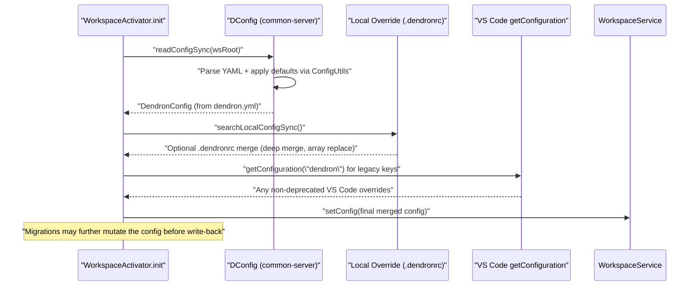

### 17.3 Key Classes and Files

- **`DConfig`** (`packages/common-server/src/DConfig.ts`)
  - `readConfigSync(wsRoot)`
  - `readConfigAndApplyLocalOverrideSync(wsRoot)` — does the `.dendronrc` merge
  - `writeConfig` / `setConfig` via WorkspaceService
  - `configPath`, `configOverridePath`

- **`ConfigUtils`** (`packages/common-all/src/utils/config.ts`)
  - `genLatestConfig()`, `genDefaultConfig()`
  - `getJournal()`, `getScratch()`, `getPublishing()`, etc. — safe accessors
  - `parse()` + Zod-like validation in newer versions

- **`WorkspaceService`** (`packages/engine-server/src/workspace/service.ts`)
  - `runMigrationsIfNecessary(...)`
  - `setConfig(config)`
  - `getCodeWorkspaceSettingsSync()` (for `.code-workspace` files)

- **`MetadataService`** (`packages/engine-server/src/metadata/service.ts`)
  - **Not** dendron.yml — this is global user state (`~/.dendron/meta.json`)
  - Stores: first install, surveys, graph depth preferences, tip-of-day index, activation context, recent workspaces, etc.
  - Singleton pattern: `MetadataService.instance().getMeta()`
  - Persisted across all workspaces on the machine.

### 17.4 Mermaid: Migration Sequence During First Activation or Upgrade

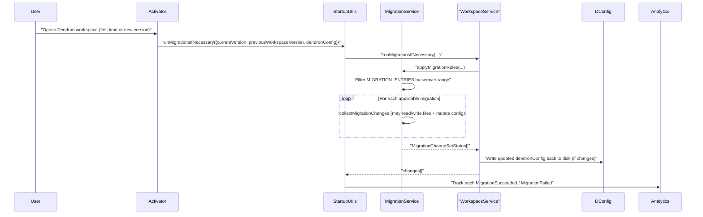

**Important migration locations**:
- `packages/engine-server/src/migrations/migrations.ts` — the `MIGRATION_ENTRIES` array (version + change list)
- `packages/engine-server/src/migrations/service.ts` — the runner
- Many migrations are one-way and may create new vaults, rewrite frontmatter, update publishing config, etc.

### 17.5 VS Code Contribution Points (package.json)

See `contributes.configuration` starting at line ~1204 in `packages/plugin-core/package.json`.

Most entries now carry the explicit note:

```json
"dendron.defaultJournalName": {
  "description": "DEPRECATED. Use journal settings in dendron.yml"
}
```

A few settings still matter at runtime (e.g. `dendron.logLevel`, `dendron.rootDir` for legacy workspace detection, some preview/timestamp formatting).

The extension reads VS Code config via:

```ts
const config = vscode.workspace.getConfiguration();
const logLevel = config.get<string>("dendron.logLevel");
```

But the modern path is almost always through the merged `DendronConfig` object obtained from the engine or `ext.getDWorkspace().config`.

### 17.6 Practical Implications for Maintenance

1. **When adding a new setting**: Decide first whether it belongs in `dendron.yml` (user-facing, versioned with the workspace) or `MetadataService` (UI preference, global to the user) or a plain VS Code setting (rare now).
2. **When reading config in commands/providers**: Prefer `ConfigUtils.getXXX(DendronExtension.instance().getDWorkspace().config)` over raw VS Code `getConfiguration`.
3. **Migrations are your friend** (and your enemy): Any breaking change to the config shape or vault layout **must** have a migration entry or users on old vaults will see broken behavior.
4. **Local overrides** (`.dendronrc.yml`) are deliberately **not** checked into git in most setups — treat them like `.env`.

---

## 18. Deep Dive: Testing Patterns

Dendron's test suite is unusually large and sophisticated for a VS Code extension. It mixes unit, integration, and "in-VS Code" tests.

### 18.1 Test Categories

| Category          | Location                        | How They Run                              | Characteristics |
|-------------------|---------------------------------|-------------------------------------------|-----------------|
| **Unit**          | Various `*.spec.ts` / `*.test.ts` (not in suite-integ) | `yarn test` at root (Jest)               | Fast, no VS Code, heavy mocking |
| **Integration (In-Process)** | `src/test/suite/` + some others | Via mocha directly                       | Use mock engine / extension |
| **Integration (Full VS Code)** | `src/test/suite-integ/` (hundreds of files) | `yarn test` inside plugin-core (after compile) | Real `vscode-test` + downloaded VS Code instance + real workspace on disk |
| **Perf**          | `src/test/perf-test/`           | Special `runPerfTest.ts`                 | Instrumented with PerformanceTimer, long-running |
| **Webview**       | `src/web/test/`                 | Separate web test runner                 | Browser-based extension tests |

### 18.2 The Integration Test Harness (The One You Will Use Most)

The dominant pattern for "does this command actually work end-to-end?" lives in `suite-integ/`.

**Entry points**:
- `src/test/runTestInteg.ts` — calls `vscode-test.runTests()` with `--disable-extensions`
- `src/test/suite-integ/index.ts` — Mocha setup that globs `**/*.test.js` (note: runs the **compiled** JS)
- `src/test/testUtilsv2.ts` + `testUtilsV3.ts` — the real workhorses

**Typical integration test skeleton** (from `SetupWorkspace.test.ts`, `NoteLookupCommand.test.ts`, etc.):

```ts
suite("MyFeature", function () {
  let ctx: ExtensionContext;
  let ext: IDendronExtension;

  beforeEach(async () => {
    // 1. Create a fresh temporary workspace on disk
    const ws = await setupCodeWorkspaceMultiVaultV2({
      ctx,
      preSetupHook: async ({ vaults, wsRoot }) => {
        // Write real .md files, dendron.yml, etc. before activation
        await NoteTestUtilsV4.createNote({ ... });
      },
    });

    // 2. Activate the real extension against that workspace
    await _activate(ctx);

    ext = ExtensionProvider.getExtension();
  });

  afterEach(async () => {
    // Careful cleanup — sinon.restore(), close editors, etc.
    sinon.restore();
  });

  test("WHEN ... THEN ...", async () => {
    const cmd = new MyCommand();
    await cmd.run();
    // Assert on engine state, files on disk, tree views, etc.
  });
});
```

### 18.3 Key Test Utilities

- `setupCodeWorkspaceMultiVaultV2` / `setupCodeWorkspaceV3` — creates real on-disk vaults + `dendron.yml` + optional `.code-workspace`
- `preSetupHook` / `postSetupHook` — let you mutate the workspace **before** the engine starts indexing (critical for testing migrations, seeds, bad states)
- `NoteTestUtilsV4` (from `@dendronhq/common-test-utils`) — factory for creating notes/schemas with specific frontmatter, links, etc.
- `DendronExtension.configuration = () => ({...})` overrides for faking VS Code settings
- `MockDendronExtension`, `MockEngineEvents`, `MockPreviewProxy`

### 18.4 Running & Debugging Tests (Modern Setup)

Inside `packages/plugin-core/`:

```bash
# After compile
yarn test
# or a single file (by matching the compiled name)
TEST_TO_RUN=NoteLookupCommand yarn test
```

For **debugging** a test (breakpoints inside commands/providers):

1. Compile the extension (`yarn compile` or watch).
2. In VS Code, use the "Extension Tests" launch configuration (or create one pointing at `runTestInteg.js`).
3. Set breakpoints in the `.ts` source — source maps usually work.
4. The test runner will launch a **clean VS Code instance** with your extension loaded against a temp workspace it creates.

Common pain points:
- Tests are slow (each full integ test spins up a real VS Code + engine server).
- Many tests are order-dependent or leave global state (MetadataService writes to `~/.dendron/meta.json`).
- Always use `sinon.restore()` in afterEach.
- Native modules (sqlite3) must be built for the exact VS Code Node version that `vscode-test` downloads.

### 18.5 Mermaid: Full Integration Test Lifecycle

```mermaid
sequenceDiagram
    participant Dev as "Developer (yarn test)"
    participant Runner as runTestInteg.ts
    participant VSCodeTest as vscode-test
    participant VSCode as Clean VS Code Instance
    participant Mocha as suite-integ/index.ts
    participant Test as Individual *.test.ts
    participant Utils as testUtilsv*.ts + NoteTestUtils

    Dev->>Runner: yarn test [TEST_TO_RUN=...]
    Runner->>VSCodeTest: "runTests({ extensionDevelopmentPath, extensionTestsPath, launchArgs: [\"--disable-extensions\"] })"
    VSCodeTest->>VSCodeTest: Download matching VS Code + unzip
    VSCodeTest->>VSCode: Launch with extension loaded + env STAGE=test
    VSCode->>Mocha: require("./suite-integ/index")
    Mocha->>Mocha: glob **/*.test.js (filtered by TEST_TO_RUN)
    loop For each test file
        Mocha->>Test: beforeEach
        Test->>Utils: setupCodeWorkspaceMultiVaultV2({ preSetupHook })
        Utils->>Utils: Write real files + dendron.yml to /tmp/...
        Test->>_activate: Activate real DendronExtension against the temp ws
        _activate->>Engine: Full engine server spawn + reloadWorkspace
        Test->>Test: Run test body (real commands, real providers)
        Test->>Utils: Assertions (engine state, files on disk, UI)
        Test->>Test: afterEach + sinon.restore
    end
```

This architecture is why Dendron tests catch real bugs that pure unit tests miss, but also why they are slow and occasionally flaky.

---

## 19. Deeper Dives: Selected Subsystems (Preview, Engine Init, Webview Bundling)

These are targeted expansions of topics introduced earlier in this document.

### 19.1 Preview Panel Internals (The Most Complex Webview)

**File**: `src/components/views/PreviewPanel.ts` (and the web/ variant for the new web extension).

Key behaviors beyond what was covered earlier:

- **Locking**: `togglePreviewLock` command sets `_lockedEditorNoteId`. While locked, `onDidChangeActiveTextEditor` is ignored.
- **Debounced document updates**: 200ms debounce on `onDidChangeTextDocument` to avoid thrashing the unified pipeline on every keystroke.
- **Image URL rewriting**: The extension host parses the Markdown, finds local image URLs, rewrites them via `panel.webview.asWebviewUri(vscode.Uri.file(absPath))`, and caches the mapping by content hash so it doesn't redo work on every refresh.
- **Two rendering paths**:
  1. Old: Markdown -> remark/rehype on extension host -> HTML string sent to webview.
  2. Newer (webviews package): More work moved to the React side using the same unified pipeline compiled for the browser.

**Mermaid: Preview Update Decision Tree**

```mermaid
flowchart TD
    A[onDidChangeActiveTextEditor or debounced onDidChangeTextDocument] --> B{Preview panel exists?}
    B -->|No| C[Create + show]
    B -->|Yes| D{Is locked?}
    D -->|Yes| E{Locked note ID matches current editor?}
    E -->|No| F[Ignore]
    E -->|Yes| G[Refresh with explicit note]
    D -->|No| H[Refresh with active editor note]
    C --> I[Send HTML via postMessage]
    G --> I
    H --> I
    I --> J[Webview applies + scrolls to header if needed]
```

### 19.2 Engine Initialization Sub-Phases (Performance Hot Path)

From `DendronEngineV2.init()` (`packages/engine-server/src/enginev2.ts`):

```ts
perf.before("storeInit");
const { data } = await this.store.init();   // SQLite + file system scan
perf.after("storeInit");

perf.before("updateIndexNote");
await this.updateIndex("note");             // Build note index + links
perf.after("updateIndexNote");

perf.before("updateIndexSchema");
await this.updateIndex("schema");
perf.after("updateIndexSchema");
```

Each of these is instrumented (we added many of the marks). On a large vault the `updateIndex("note")` phase dominates because it walks every note, parses wikilinks, and builds the reverse link index.

The engine also does a large amount of work **after** these phases in `postInit` hooks and schema application.

### 19.3 Webview Bundling & Asset Pipeline (Why There Are Two Codebases)

This trips up almost every new contributor.

1. **Runtime webview code lives in `packages/dendron-plugin-views/`**
   - React + TypeScript + Cytoscape + AntD + custom components.
   - Built with its own webpack config (`webpack.dev.js` / `webpack.prod.js`).

2. **At extension activate time**:
   - `WebViewUtils.prepareTreeView` (or equivalent for panels) computes `localResourceRoots`.
   - In dev: points at the live `build/` directory of `dendron-plugin-views` (fast refresh works).
   - In prod: points at the copied assets inside the published `.vsix`.

3. **HTML injection**:
   - The extension generates a minimal `index.html` shell on the fly.
   - It injects `<script>` tags pointing to the bundled `*.js` via `asWebviewUri`.
   - No Node `require()` works inside the webview — everything must be bundled.

This split exists so the heavy UI can be developed with normal web tooling while the host side stays pure TypeScript that talks to the engine.

**Rule of thumb**:
- If the change is in a React component or hook → `dendron-plugin-views`
- If the change is message handling, engine calls, or panel creation → `plugin-core`

---

## 20. Where We Are Now (Option A Status)

We have completed a very substantial pass through Option A:

**Covered in depth with diagrams and code**:
- Webviews (both patterns, Preview internals, security, bundling)
- Language Providers + Lookup
- Activation + Workspace Lifecycle (two-phase model)
- Tree Views + Reactivity
- Commands Architecture
- Engine Connection Model (the separate process story)
- **Configuration & Settings System** (new in this update)
- **Testing Patterns** (new in this update)
- Deeper subsystem dives (Preview reactivity, engine init phases, webview assets)

This document is now one of the best single resources for onboarding a new maintainer to the Dendron codebase.

**Natural next directions** (when you are ready):
- Option B: Expand the "Key VS Code Contribution Points" reference section into a complete enumerated list with line numbers into package.json.
- Option C: Create the compact "VS Code API Cheat Sheet for Dendron Developers" (one-page quick reference).
- Option D: Pick 2–3 of the most critical files and do line-by-line annotated walkthroughs (with call graphs).

Just tell me which direction (or any specific file/subsystem) you'd like to tackle next, and we'll keep building your knowledge base.

---

*End of current Option A deep-dive pass (as of this session).*