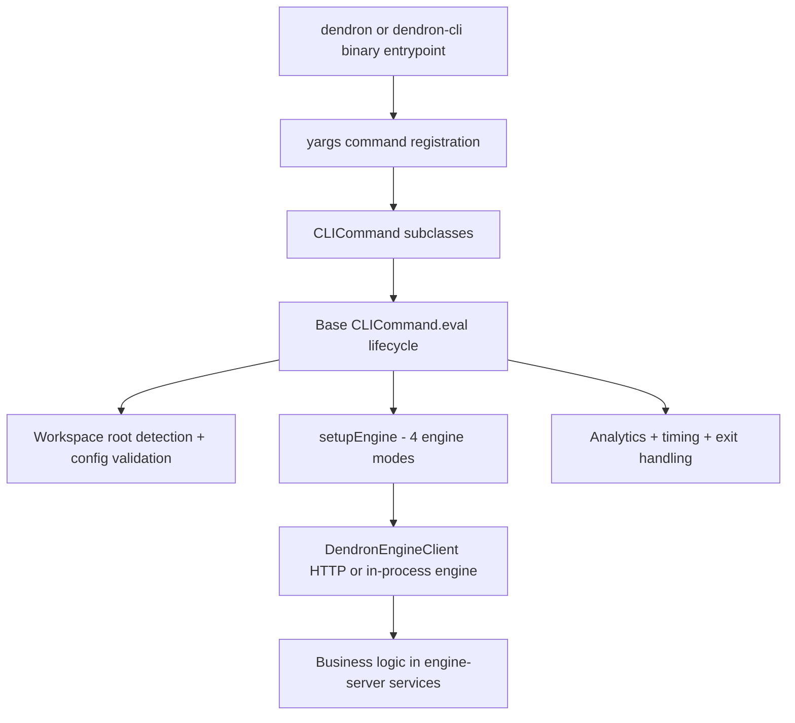
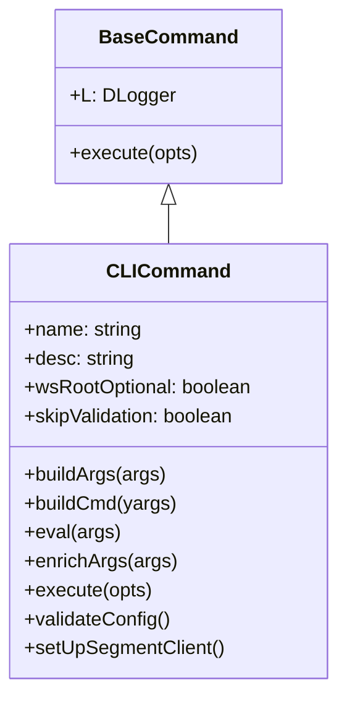
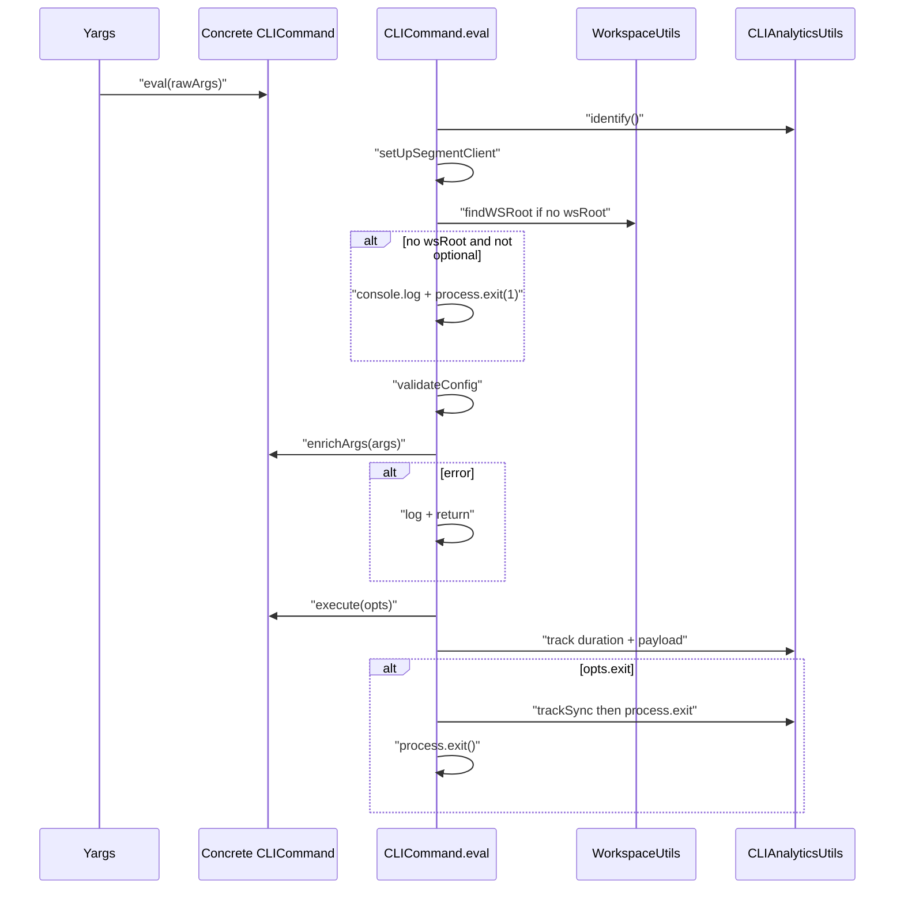
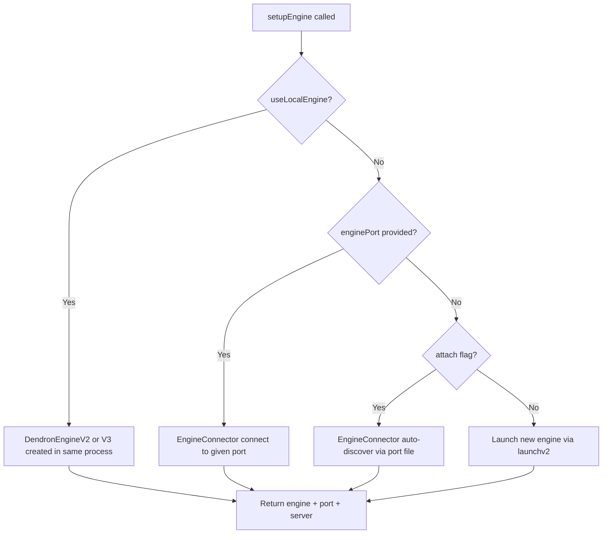

# Dendron CLI Deep Dive

This document provides an exhaustive, internal look at the `dendron-cli` package (`@dendronhq/dendron-cli`).

It is written for maintainers who want to understand, debug, extend, or fork the CLI.

> **Scope**: Everything from the binary entrypoint, yargs registration, the `CLICommand` base class lifecycle, all engine connection modes, every major command family, telemetry, the relationship to the VS Code extension, port file protocol, dev tooling, and practical gotchas.

## Table of Contents

- [1. High-Level Purpose and Architecture](#1-high-level-purpose-and-architecture)
- [2. The Binary Entry Point](#2-the-binary-entry-point)
- [3. The Core Abstraction: CLICommand](#3-the-core-abstraction-clicommand)
- [4. Workspace Root Detection & Config Validation](#4-workspace-root-detection--config-validation)
- [5. The Engine Connection Model](#5-the-engine-connection-model-the-most-important-cli-concept)
- [6. Major Command Families](#6-major-command-families)
- [7. Supporting Utilities](#7-supporting-utilities)
- [8. Relationship to the VS Code Extension](#8-relationship-to-the-vs-code-extension)
- [9. Practical Guide for Maintainers](#9-practical-guide-for-maintainers)
- [10. Current State & Future Directions](#10-current-state--future-directions-as-of-this-writing)

---


## 1. High-Level Purpose and Architecture

The Dendron CLI exists for three main reasons:

1. **Automation & Scripting** — `dendron doctor`, `dendron workspace sync`, pods, etc. without opening VS Code.
2. **Engine Reuse** — The same `DendronEngineV2`/`V3` that powers the desktop extension can be driven from the command line.
3. **Development & Release Tooling** — The heavy `dendron dev ...` commands used by the core team (bumping, publishing, generating test vaults, running migrations, etc.).

### Mermaid: Overall CLI Architecture



The CLI is deliberately **thin**. Almost all real work lives in the shared `@dendronhq/engine-server`, `@dendronhq/common-all`, and `@dendronhq/pods-core` packages.

---

## 2. The Binary Entry Point

**File**: `packages/dendron-cli/bin/dendron-cli.ts`

```ts
#!/usr/bin/env node
...
new ExportPodCLICommand().buildCmd(buildYargs);
new LaunchEngineServerCommand().buildCmd(buildYargs);
// ... 12 more
buildYargs.strictCommands().demandCommand(1).help().argv;
```

### Key Facts

- Both `dendron` and `dendron-cli` binaries are registered in `package.json` pointing to the exact same compiled file:
  ```json
  "bin": {
    "dendron-cli": "./lib/bin/dendron-cli.js",
    "dendron": "./lib/bin/dendron-cli.js"
  }
  ```
- Default log level is forced to `error` unless `LOG_LEVEL` is already set in the environment.
- Every command is instantiated at load time and calls `buildCmd(yargs)`.
- `strictCommands()` + `demandCommand(1)` means unknown commands and missing subcommands are hard errors.

This registration pattern is simple but means **all command modules are loaded** even if you only run `dendron --help`.

---

## 3. The Core Abstraction: CLICommand

**File**: `packages/dendron-cli/src/commands/base.ts`

Almost every command extends `CLICommand<TOpts, TOut>`, which itself extends `BaseCommand`.

### Class Hierarchy



### 3.1 The eval() Method — The Heart of Every Command

This is the single most important method to understand.

**Full flow (simplified)**:



### 3.2 enrichArgs vs execute

- `enrichArgs`: Convert raw yargs strings into rich, typed objects. This is where most commands call `setupEngine(...)`.
- `execute`: Do the actual work. Should be as pure as possible.

Many commands do almost nothing in `execute` besides delegating to a service from `engine-server`.

### 3.3 Common Args Injected by Base

Every command that calls `super.buildArgs(args)` automatically gets:

- `--wsRoot`
- `--vault`
- `--quiet`
- `--devMode` (hidden, sets stage for telemetry)

---

## 4. Workspace Root Detection & Config Validation

### Workspace Root Discovery

`WorkspaceUtils.findWSRoot()` (from `@dendronhq/engine-server`) walks upward from `process.cwd()` looking for a `dendron.yml` (or legacy `dendron.code-workspace`).

If nothing is found and `wsRootOptional` is not set on the command, the CLI hard-exits.

### Config Version Validation (`validateConfig`)

This is a **very important guard** that many users hit.

It compares:

- `clientVersion` = version of the installed `@dendronhq/dendron-cli` (read from its own `package.json`)
- `configVersion` = the `version` field at the top of `dendron.yml`

It uses `ConfigUtils.configIsValid(...)` and can produce hard exits with helpful messages like:

```
current client version:            ❌ 0.124.0
current config version:            ✅ 0.124.0
minimum compatible client version: 0.125.0

Please make sure dendron-cli is up to date...
```

There is also a "soft mapping" mode that only warns.

This mechanism is why running an old CLI against a newer vault (or vice versa) often fails early with a clear message.

---

## 5. The Engine Connection Model (The Most Important CLI Concept)

This is the CLI equivalent of the "Engine Connection Model" section in the VS Code deep-dive.

The CLI can talk to the Dendron engine in **four completely different ways**.

### 5.1 The Four Modes (Comparison)

| Mode                  | Flag / Option          | Process Model          | When to Use                              | Port File Written? | Indexing? |
|-----------------------|------------------------|------------------------|------------------------------------------|--------------------|-----------|
| **Spawn (default)**   | (none)                 | Separate Node process  | Most normal CLI usage                    | `.dendron.port.cli` | Yes (unless `--fast`) |
| **Attach**            | `--attach`             | Connect to existing    | Talk to a running VS Code instance       | No (reads)        | Optional |
| **Specific Port**     | `--enginePort 1234`    | Connect to specific    | Scripting against a known server         | No                | Optional |
| **In-Memory**         | `--useLocalEngine`     | Same process (V2 or V3)| Fast tests, certain dev commands         | No                | Caller decides |

### 5.2 Mermaid: setupEngine Decision Flow



### 5.3 Key Implementation Files

- `packages/dendron-cli/src/commands/utils.ts` → `setupEngine` + `setupEngineArgs`
- `packages/dendron-cli/src/commands/launchEngineServer.ts` → the "spawn" path
- `packages/api-server/src/index.ts` → `launchv2` (the actual HTTP server)
- `packages/engine-server/src/topics/connector.ts` → `EngineConnector` (attach + port override logic)
- `packages/engine-server/src/utils/engineUtils.ts` → port file helpers (note the `.cli` suffix)

### 5.4 The Two Port Files (Critical Gotcha)

Dendron deliberately uses **separate port files** so the desktop extension and CLI can run independent engines:

- `.dendron.port` — written by the VS Code extension (`WorkspaceActivator`)
- `.dendron.port.cli` — written by the CLI (`LaunchEngineServerCommand` via `EngineUtils.writeEnginePortForCLI`)

This is why you can have both a desktop window and a long-running `dendron` command operating on the same vault at the same time without port conflicts.

---

## 6. Major Command Families

### 6.1 Workspace Commands (`dendron workspace <cmd>`)

**File**: `workspaceCLICommand.ts`

Subcommands:
- `init`, `info`
- `pull`, `push`, `addAndCommit`, `sync`, `removeCache`

These are thin wrappers around `WorkspaceService` methods (`pullVaults`, `commitAndAddAll`, etc.).

They almost always require an engine (for `sync` / `addAndCommit`).

### 6.2 Notes Commands (`dendron notes ...`)

**File**: `notes.ts`

One of the richest command groups. It re-uses a lot of the same lookup and note manipulation logic that powers the desktop extension.

Supported subcommands (`NoteCommands` enum):

- `lookup` — fuzzy title search (similar to the famous `Cmd+L` experience)
- `get` — fetch by note id
- `find` — query by various note properties
- `lookup_legacy` — older engine path (mostly for compatibility)
- `delete` — delete by fname + vault
- `move` — rename within workspace or move across vaults
- `write` — create or overwrite a note (supply `--body`)

Output formats are controllable via `--output`:
- `json`
- `md_gfm` (GitHub-flavored Markdown)
- `md_dendron` (Dendron-flavored with wikilinks)

This command group is an excellent example of the CLI exposing the same `DEngineClient` methods (`findNotes`, `writeNote`, `deleteNote`, etc.) that the VS Code extension uses.

### 6.3 Doctor (`dendron doctor`)

**File**: `doctor.ts`

Delegates entirely to `DoctorService` in `engine-server`.

Common actions: `fixFrontmatter`, `fixInvalidFilenames`, `regenerateNoteId`, Airtable export, etc.

Supports `--dryRun`, `--query`, `--limit`.

### 6.4 Pods (Import / Export / Publish)

Several related commands:

- `exportPod`, `exportPodV2`
- `importPod`
- `publishPod`
- `podsV2`

These use the pod system from `@dendronhq/pods-core`.

The V2 pod commands are the modern path.

### 6.5 Seeds (`dendron seed ...`)

**File**: `seedCLICommand.ts`

Commands for adding, removing, and initializing seed vaults.

### 6.6 Vault (`dendron vault ...`)

**File**: `vaultCLICommand.ts`

Add, remove, convert, etc.

### 6.7 Visualize (`dendron visualize ...`)

**File**: `visualizeCLICommand.ts`

Uses the `@dendronhq/dendron-viz` package.

### 6.8 Publish (`dendron publish ...`)

**File**: `publishCLICommand.ts`

Next.js-based publishing from the CLI.

### 6.9 Backfill (`backfillV2`)

This is a special internal/low-level command (registered as `backfillV2`).

It extends `BaseCommand` directly (bypassing most of the `CLICommand` conveniences) and delegates to `BackfillService.updateNotes`.

Primarily used for bulk-updating note frontmatter or content across an entire vault (e.g. adding missing fields after a schema change). Not intended for daily interactive use.

### 6.10 Dev Commands (`dendron dev <cmd>`) — Extremely Powerful

**File**: `devCLICommand.ts`

This command group has `wsRootOptional = true` and `skipValidation = true` because it is often used during development before a proper workspace exists.

Notable subcommands:

- `run_migration` — manually run a specific migration (very useful when debugging config issues)
- `generate_json_schema_from_config` — regenerates the `dendron-yml.validator.json`
- `create_test_vault` — programmatically creates large synthetic vaults for performance testing
- `build`, `bump_version`, `publish`, `prep_plugin`, `package_plugin`, etc. — the entire internal release pipeline
- Telemetry on/off/show

Many of these call into `BuildUtils` and `LernaUtils` from `src/utils/build.ts`.

---

## 7. Supporting Utilities

### 7.1 Analytics & Telemetry

- `CLIAnalyticsUtils` wraps `SegmentClient` / `SegmentUtils`
- First-run behavior: if no Segment config exists, it prints a notice and enables telemetry by default (user can opt out later)
- Every command execution is tracked with duration + custom payload

### 7.2 Build & Release Tooling (`utils/build.ts`)

Contains:
- `BuildUtils` — finding lerna root, version reading, plugin prep, asset syncing
- `LernaUtils` — version bumping + publishing
- Enums: `SemverVersion`, `PublishEndpoint`, `ExtensionType`

This code is only used by `dendron dev ...` commands.

### 7.3 SpinnerUtils

Thin wrapper around the `ora` package for nice CLI progress output.

---

## 8. Relationship to the VS Code Extension

The CLI and the desktop extension are **two different UIs over the same core**.

### Shared Components

- `WorkspaceService`
- `DConfig`, `ConfigUtils`
- `DoctorService`, `MigrationService`, `SeedService`, etc.
- `DendronEngineV2` / `V3` + `DendronEngineClient`
- The entire pod system
- Analytics (different `AppNames` though: `CLI` vs `VSCODE`)

### Key Differences

| Aspect                    | VS Code Extension                     | CLI                                      |
|---------------------------|---------------------------------------|------------------------------------------|
| Activation                | `activate()` in `_extension.ts`       | yargs `eval()`                           |
| Engine hosting            | Usually spawns via `WorkspaceActivator` | `setupEngine` decides                    |
| Port file                 | `.dendron.port`                       | `.dendron.port.cli`                      |
| UI                        | Webviews + TreeViews + QuickPick      | stdout + ora spinners + prompts          |
| Long-running server       | Yes (until window closes)             | Usually short-lived (unless `--attach`)  |
| Telemetry default         | On                                    | On (with first-run notice)               |

The `attach` mode in the CLI is the bridge that lets you drive a running desktop Dendron instance from the command line.

---

## 9. Practical Guide for Maintainers

### Adding a New Command

1. Create `src/commands/myNewCommand.ts`
2. Extend `CLICommand`
3. Implement `buildArgs`, `enrichArgs`, `execute`
4. Export it from `src/commands/index.ts`
5. Register it in `bin/dendron-cli.ts`
6. Add tests (if any exist for CLI — coverage is currently light)

### Debugging a CLI Command

- `LOG_LEVEL=debug dendron ...`
- `node --inspect-brk ./lib/bin/dendron-cli.js ...` (after compile)
- For engine-level debugging, use `--useLocalEngine` when possible (much easier to step through)

### Common Gotchas

1. **Config version mismatch** — the most frequent user-facing error.
2. **Two different port files** — `attach` may connect to the wrong engine if you have both a desktop and a previous CLI run.
3. **All commands load at startup** — adding heavy top-level imports slows `--help`.
4. **Telemetry is synchronous on exit paths** (`trackSync` + `process.exit`).
5. **Dev commands bypass validation** — they can run against broken or non-existent workspaces.
6. **Native modules** (sqlite3, etc.) must be compatible with the Node version running the CLI.

---

## 10. Current State & Future Directions (as of this writing)

Recent improvements (May 2026):
- Global `--json` support for scripting (see `base.ts` + `printJson`).
- Shell completion: `dendron completion`.
- Cleaner first-run telemetry message.
- Better error messages (no workspace, DendronError output).

The CLI is mature for workspace/pod/doctor use cases but:

- Test coverage is minimal compared to the extension.
- Many commands still use the older pod system (V1) alongside V2.
- The `dendron dev` command group contains a lot of Dendron-team-only release automation that could be confusing for external contributors.
- There is no interactive REPL or long-running "CLI server" mode (though `--attach` gets close).

---

This document is intended to be a living reference. As you explore specific commands or add new functionality, please expand the relevant sections with additional diagrams, code listings, and edge cases.

**Next recommended deep dives** (if you want to continue this series):
- The full `api-server` HTTP API surface
- How pods are implemented end-to-end
- The migration system in exhaustive detail
- The relationship between `DendronEngineV2` vs `V3`

Just say the word and we'll go deeper on any of these.