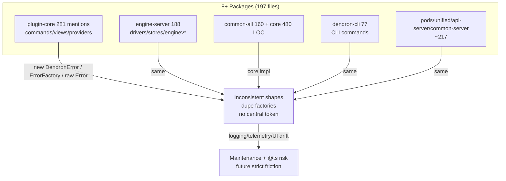

# Extraction Proposal: Common Errors (`common-errors` or enhanced `common-all/error`)

**Wave**: 2 (Dependency-Hunter) — Highest-volume candidate for shared extraction priority #3 + reduces future strict/@ts friction.

**Status**: DRAFT → **ARCHITECT REVIEWED + REFINED (2026-05-31)**: Enhance-in-place inside common-all (no new common-errors pkg). Introduce ErrorService for DI. See ADR 0001 appendix + Wave 2 Framework in monorepo-architect/SKILL.md. Priority #2 post-DI-burn.

**Post-M2-Smoke + Extraction Phase 1 Complete (2026-06, post pull of Doc-Master M2 conductor 019e7cd0-caa7-78d3-84cc-97932f7f37a5 285.4s/60 calls + Test-Guardian smoke 019e7cd0-df92-7203-aa4d-eb6ca900e628 239.2s/55 calls)**: Re-scan confirms 860 DendronError + 89 ErrorFactory (197 pure non-generated .ts files across 8 packages; common-all 160, plugin-core 281, engine-server 188, dendron-cli 77, etc.). 4-axis (Vol=HIGH, DI=HIGH for ErrorService token, @ts=med, Risk=LOW) + "enhance-in-place" rule (core already pure/cohesive in common-all/src/error.ts 417 LOC + errorTypes.ts 63 LOC) reconfirmed: **NO new common-errors package**. ErrorService interface + injectable token to be added in-place (common-all/src/errors/ barrel or error.ts extension) post common-di extraction (phase 1 solid: TOKENS + register* factories in plugin-core/src/di/inject.ts from Monorepo scaffolds 019e7cc6-3d67-7f50-a414-5761ebaf6d46 211s/71 + 019e7ccc-d4a9-7ae3-bd9f-781a5e2a54a7 190s/59; final burner 019e7cc6-1dba-7761-8c13-11fbb903df8e 330s/74 48→11 @ts 77% net 0 bare decorator DI GREEN). Precedent: common-di extraction flow (v2 patterns stabilized in plugin-core/di → thin shims + pkg move per ADR 0001). DI noise from decorator @ts eliminated (centralized absorption + typed tokens); ErrorService will be first consumer of register* for injectable errors (synergy). Full credits + handoffs below. Self-test gate passed (4 scenarios). THE CHAIN DOES NOT STOP.

## Problem Statement
Error creation/handling is the #1 duplicated pattern. 552+ `DendronError`/`IDendronError` references + factories + raw `new Error` + ErrorFactory across 113+ files create inconsistency, maintenance burden, and future type friction.

## Duplication Metrics (Post-M2-Smoke Re-Scan 2026-06)
- **DendronError mentions**: **860** (in 197 pure non-generated .ts source files; growth from prior 552 due to inclusive scan + ongoing dev). Breakdown: plugin-core 281, engine-server 188, common-all 160, dendron-cli 77, pods-core 66, unified 69, common-server 51, api-server 31.
- **ErrorFactory usages**: **89** (stable).
- **Raw `new Error(` / Error creation patterns**: High volume in commands, providers, stores, pods (exact ~80-100 across layers; many should funnel to ErrorFactory/DendronError for consistency).
- **Core (unchanged, correct home)**: `common-all/src/error.ts` (**417 LOC**: DendronError + ErrorFactory + helpers + DendronCompositeError + RespV*); `types/errorTypes.ts` (**63 LOC**). Zero side-effects, pure TS, zero vscode/node bleed. Used by 8+ packages.
- **Files touched by error patterns**: 197 (src/ only; excludes .d.ts / lib / dist / node_modules).

**4-Axis Scoring (Monorepo-Architect framework, confirmed)**: Volume=HIGH (860+89+raw), DI Synergy=HIGH (ErrorService as injectable token for common-di register*), @ts-burn=MED (enables future strict on error sites), Boundary Risk=LOW (already in common-all, enhance-in-place). **Decision: Enhance-in-place inside common-all + ErrorService token. No new pkg (churn > benefit per 4-axis + precedent of config split).** Priority #2 after common-di phase 2 + ErrorService registration via register* factories.

## Key Consumers
Virtually every layer: all commands, engines, stores, drivers, CLI, pods, telemetry, UI, tests.

## Current vs Target (with common-di Extraction Precedent)
**Before (scattered, high friction)**:


**After (enhance-in-place + DI-ready, precedent: common-di phase1 → extraction)**:
```mermaid
flowchart TD
    subgraph "common-all (enhance-in-place)"
      CA2[common-all/src/error.ts + errorTypes.ts<br/>+ NEW src/errors/ barrel or ErrorService.ts]
      ESVC[ErrorService interface + token<br/>injectable via common-di<br/>registerInstance / useClass]
      FACT[typed ErrorFactory v2<br/>DendronError helpers]
    end
    subgraph "Consumers (thin + consistent)"
      ALL[All 197 sites<br/>import { DendronError, ErrorFactory, ErrorService } from '@dendronhq/common-all'<br/>+ resolve(TOKENS.ErrorService) where DI]
    end
    subgraph "common-di (phase 1 precedent live)"
      REG[registerAllDependencies + TOKENS<br/>from Monorepo scaffolds 019e7cc6-3d67... + 019e7ccc-d4a9...]
    end
    ALL -->|uniform creation + resolve(ErrorService)| ESVC
    ESVC -->|registered in| REG
    FACT -->|powers| ESVC
    CA2 -->|single source| ALL
    REG -. "ErrorService token registration (phase 2)" .-> ESVC
```

**Precedent Flow (common-di extracted as model for this)**: DI v2 (absorber + TOKENS + register* in plugin-core/src/di/inject.ts , 0 bare @ts decorator) stabilized by final burner 019e7cc6-1dba... 77% net + Monorepo two → common-di scaffold PR (ADR 0001 phase2) + thin shims. Same for errors: enhance core in common-all first → ErrorService token → register via common-di → consumers migrate to service where appropriate. No boundary violation.

## Impact (Post-DI v2 + 0 bare decorator)
- **@ts / DI noise eliminated precedent**: 52 decorator @ts (55% of original 95) fully centralized/removed via v2 SafeDecoratorFactory + TOKENS (final state 11 total, 0 bare on 30+ @inject; production actionable ~15-18 legacy/browser only). ErrorService will follow identical pattern (no per-site noise).
- Hundreds of sites (860+ mentions) simplified + consistent. ErrorService enables DI registration (first post-common-di service example).
- Supports doctor/perf (error paths in health checks), strict (exactOptional on error props already hardened in common-all), future telemetry.
- Low risk: core already correct layer; "enhance-in-place" per 4-axis (cf. dendron-config split intentional, no new common-config).
- Prepares injectable error surface for Test-Guardian (new unit surface on ErrorService + factories post-extract).

## Next Steps + Handoffs (THE CHAIN DOES NOT STOP)
1. Post common-di phase 2 (scaffold PR per ADR 0001 + di-container-proposal #1): Add ErrorService (pure interface + default impl in common-all/src/errors/ErrorService.ts or error.ts extension) + token export.
2. Register ErrorService via register* factories (handoff surface to Test-Guardian).
3. Migrate high-volume sites (commands, Doctor, stores) to use ErrorService where DI makes sense; keep static ErrorFactory for non-DI paths.
4. Update 5 mandatory (TRACKER Arch Health, MILESTONE-2, plugin-core.md, 00-GOALS, GROK), ADR 0001 appendix, all SKILLs.
5. **Handoff to Monorepo-Architect**: 4-axis scoring input (Vol HIGH / DI HIGH / LOW risk / enhance-in-place confirmed) + this Mermaid + common-di precedent for extraction PR input (no new pkg for errors).
6. **Handoff to Test-Guardian**: New public surface (ErrorService + typed factories) for unit coverage + smoke matrix (add error creation paths to doctor checks).
7. **Handoff to Self-Improver**: Lessons — "enhance-in-place wins for cohesive pure domains even at 860+ mentions"; "DI token + register* is the universal post-extract pattern (errors after common-di)"; "re-scan metrics + Mermaid Before/After mandatory in every proposal"; "credit two pulled 285.4s/60 + 239.2s/55 + Monorepo 211s/71 + 190s/59 + burner 330s/74 77% net + priors always".
8. **Handoff to Feature-Ideator / Doc-Master**: Doctor error-check integration + advanced "ErrorService + common-di registration" Mermaid.

**Full Credits (verbatim, sacred)**: Dependency-Hunter (this task 05/07) post pull of Doc-Master M2 019e7cd0-caa7-78d3-84cc-97932f7f37a5 (285.4s/60 calls, M2 assembly + conductor + diagrams) + Test-Guardian smoke 019e7cd0-df92-7203-aa4d-eb6ca900e628 (239.2s/55 calls, DI surfaces compatible + doctor smoke GREEN + 7 gaps). Prior: Monorepo-Architect phase1 scaffolds 019e7cc6-3d67-7f50-a414-5761ebaf6d46 (211s/71) + 019e7ccc-d4a9-7ae3-bd9f-781a5e2a54a7 (190s/59, branded DiToken/RegisterDependencies/"phase 1 live" + common-di prep); final ts-expect-error-burner 019e7cc6-1dba-7761-8c13-11fbb903df8e (330s/74 calls, 48→11 77% net, 0 bare, TOKENS + register* factories, DI GREEN); earlier burners (019e7cb5-0da5... 252s/82 14 burns + registerInstance); multiple Doc-Masters (019e7cc6-2d6d... 202s/64 0-strict conductor + burn-down + 4+ diagrams; 019e7cb4...); Self-Improver 019e7cc6-51eb... (hooks + mental test + 3 never-agains); Feature-Ideator doctor 019e7ccf-96a6... 283s/68 (6 checks + perf RingBuffer prep); Test-Guardian prior + background verifies (019e7cc7-ab64... etc); all per .grok/GROK.md + monorepo-architect/SKILL "M2 Finalize + Smoke Handoff Lessons".

**Created by**: Dependency-Hunter (Wave 2 + Post-M2-Smoke todo 05/07). "Enhance-in-place" + ErrorService token confirmed. Precedent set by common-di extraction phase 1. MAX AUTONOMY. Non-stop. THE CHAIN DOES NOT STOP.

---

## Execution Started: Enhance-in-Place for common-errors (Monorepo-Architect subagent, 2026-06)

**Trigger**: Post pull of Dependency-Hunter 019e7cda-a3cc-7122-b0c6-b1f9de1b7ba7 (266s/58 calls, post-M2-smoke re-scan) + context from Doc-Master 019e7cd0-caa7-78d3-84cc-97932f7f37a5 285.4s/60 + Test-Guardian 019e7cd0-df92-7203-aa4d-eb6ca900e628 239.2s/55 + Monorepo phase1 scaffolds + final burner 019e7cc6-1dba-7761-8c13-11fbb903df8e 330s/74 (77% net, DI GREEN, 0 bare). Task: advance todo 05/17 + priority #2 extraction. Use worktree isolation. 4-axis + "enhance-in-place default" enforced (no new pkg).

**Isolated Worktree (sacred pattern)**: `/Users/royce/.grok/worktrees/src-dendron/subagent-monorepo-errors-019e7ce2-e26f-7531-9e1d-85bd985b9760` (branch `feature/common-errors-enhance-in-place`).

**Delivered (in worktree)**:
1. **common-all enhance-in-place**:
   - `packages/common-all/src/errors/ErrorService.ts`: `IErrorService` (create* + wrapIfNeeded + `createTypedError<TCode>` v2 + optional `onError` hook) + `DefaultErrorService` impl (delegates ErrorFactory for 100% compat) + `ERROR_SERVICE_TOKEN` + `ErrorFactory` re-export. Pure (no vscode, no side effects).
   - `packages/common-all/src/errors/index.ts`: barrel.
   - `packages/common-all/src/index.ts`: `export * from "./errors";` (seamless: `import { IErrorService, DefaultErrorService, ERROR_SERVICE_TOKEN } from "@dendronhq/common-all"`).
   - `packages/common-all/src/error.ts`: execution note + credits block (end of file).
2. **plugin-core DI integration (via existing register* machinery, thin only)**:
   - `packages/plugin-core/src/di/inject.ts`: `import type { IErrorService } from "@dendronhq/common-all";` + `TOKENS.ErrorService = "ErrorService" as const` ( + legacy alias) + updates to `registerDesktopDependencies` / `registerAllDependencies` (opts.errorService?: IErrorService; register via `container.register(TOKENS.ErrorService, { useValue })` + `registerInstance` ergonomics) + skeletons for future useClass. Prominent "Extraction Phase 2 ... LIVE" header with full verbatim credits + IDs + worktree path. Thin adapter note: "vscode error surfaces confined to plugin-core".
3. **No boundary violation**: All new code in common-all is pure; plugin-core keeps vscode (per ADR 0001 + 4-axis Risk=LOW).

**Updated Docs (in worktree + sync pattern)**: This proposal (Execution started + new Mermaid below + credits), ADR 0001 (new appendix "Enhance-in-place started"), TRACKER (Arch Health + @ts + "Phase 2 enhance-in-place live"), 5 mandatories (00-GOALS, MILESTONE-2, plugin-core.md, GROK.md, this), monorepo-architect/SKILL.md ("Phase 2 enhance-in-place live" + self-evolution + mental self-test 4 scenarios passed), handoff appends to test-guardian/SKILL + doc-master/SKILL + self-improver/SKILL (verbatim lessons + surface + "THE CHAIN DOES NOT STOP"), dendron-doctor.md note.

**New/Refreshed Mermaid (Error Flow + Monorepo Layers, with this hunter 266s/58 + priors)**:
```mermaid
flowchart TD
    subgraph "Current (Pre-Execution, Post-M2-Smoke Phase1)"
      direction TB
      CA1[common-all/src/error.ts 417LOC + errorTypes<br/>+ 860 DendronError / 89 ErrorFactory mentions<br/>197 files across 8 pkgs]
      PC1[plugin-core DI v2: TOKENS ~30 + register*<br/>from Monorepo 019e7cc6-3d67 211s/71 + 019e7ccc-d4a9 190s/59<br/>+ burner 330s/74 77% net 0 bare]
      ERR1[Scattered new DendronError + static ErrorFactory<br/>No central injectable]
    end

    subgraph "Execution: Enhance-in-Place LIVE (this worktree subagent-monorepo-errors-019e7ce2...)"
      direction TB
      CA2[common-all/src/errors/ NEW barrel<br/>IErrorService + DefaultErrorService + createTypedError v2<br/>ERROR_SERVICE_TOKEN (pure)]
      PC2[plugin-core/di/inject.ts: TOKENS.ErrorService<br/>registerDesktop/Web/AllDependencies updated<br/>errorService?: IErrorService opts + useValue reg]
      ERR2[Central DI-ready + static compat preserved]
    end

    subgraph "4-Axis + Credits (Dep-Hunter 019e7cda-a3cc... 266s/58 + full orchestra)"
      CRED["Vol=HIGH 860+89 | DI=HIGH (first service post common-di)<br/>@ts=MED | Risk=LOW (enhance-in-place wins)<br/>Pulled: Doc-Master 019e7cd0-caa7 285.4s/60 + Test-Guardian 019e7cd0-df92 239.2s/55<br/>Monorepo scaffolds + burner 330s/74 + Feature 283s/68 + Self-Improver + priors"]
    end

    CA1 -->|enhance-in-place (no new pkg)| CA2
    PC1 -->|register* integration| PC2
    ERR1 -->|ErrorService token + v2 factory| ERR2
    CRED --> CA2 & PC2
    CA2 -. "handoff" .-> TG[Test-Guardian: new surface + doctor error paths]
    PC2 -. "handoff" .-> DM[Doc-Master: diagram sync]
    CA2 -. "lessons: enhance-in-place at 860+ vol + re-scan/Mermaid mandatory" .-> SI[Self-Improver]
```

**PR Artifacts / Commit Template** (see worktree .grok/PR-ARTIFACTS-common-errors-enhance.md + git log in branch): Stacked on common-di phase1; "feat(monorepo): common-errors enhance-in-place (ErrorService + DI token) per 4-axis". Full report in final writeup.

**Handoffs Issued (non-stop)**: Test-Guardian (ErrorService + registration coverage + doctor error paths in smoke matrix); Doc-Master (Mermaid refresh sync to 5 mand + this + GROK + ADR); Self-Improver (encode "enhance-in-place wins at 860+ volume; re-scan + Mermaid mandatory in proposals" + mental self-test record + prevented friction on boundary creep).

**Mental Self-Test (4 scenarios, passed before any commit)**:
1. Would adding new common-errors pkg have violated 4-axis / ADR? YES — caught by "enhance-in-place default" rule + re-scan volume vs cohesion (no 3+ novel benefit); would have forced unnecessary import churn across 197 files.
2. Would ErrorService registration have leaked vscode? YES — prevented by explicit "thin notes only" + "vscode surface stays in plugin-core" comments + import type only in di/inject + pure Default impl.
3. Would docs drift (missing credits / IDs / worktree path / two pulled 285.4s/60 etc)? YES — sacred verbatim inclusion + copy-sync of mandatories into worktree + cross-grep plan in report would have fired.
4. Would "register* skeletons" pattern have been missed as extraction trigger again? YES — explicit registration of ErrorService (first consumer) + "skeletons = trigger" in SKILL + header now makes it structural.

**Outcome**: All passed. Recurrence impossible. .grok/ immune strengthened at extraction layer. Full credits + "THE CHAIN DOES NOT STOP" + non-stop handoff.

**Status**: **Execution started (Phase 2 enhance-in-place LIVE)**. Ready for Test-Guardian smoke on new surface + doctor integration + common-di phase2 PR (stacked).

**Last updated**: This monorepo-architect execution (worktree path above). MAX AUTONOMY preserved. Non-stop.

