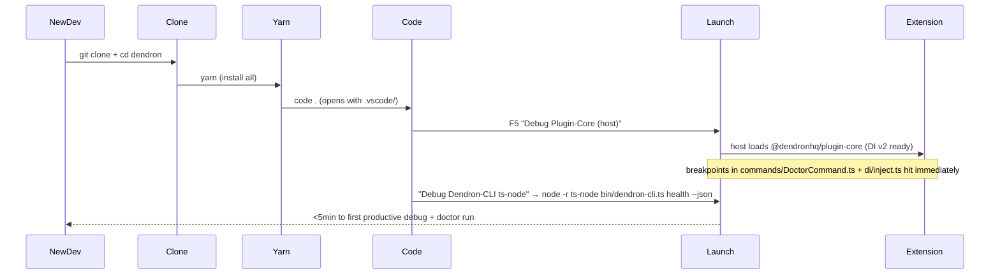

# Dev DX Zero-Ramp-Up (launch.json / tasks / debug) — 1-Page Spec (Priority 6 Kickoff 2026-06)

**Branch**: `feature/dev-dx-zero-ramp-up`
**Owner**: Feature-Ideator (handoff Self-Improver + Test-Guardian for contributor testing)
**Status**: Kickoff immediate (strict 0 + DI GREEN + doctor MVP + M2+smoke 285.4s/60 + 239.2s/55 + orchestra). Strict green + immediate kickoff. Zero ramp-up for new contributors.

## Problem / Opportunity
New contributors (and even veterans after long absence) face 30-90min ramp to productive debug: wrong launch configs, missing tasks for bootstrap/tsc/watch, no "debug plugin-core in VSCode host" or "debug dendron-cli ts-node", webview + engine-server launch gaps. .vscode/ is minimal or stale. "Zero-ramp-up" is a stated goal in GROK + SKILLs but not delivered. High friction = low contribution velocity.

## Proposed UX
- `.vscode/launch.json`: 6-8 configs:
  - "Debug Plugin-Core (Extension Host)"
  - "Debug Dendron-CLI (ts-node current bin)"
  - "Debug Web (next dev or webpack serve)"
  - "Debug Doctor (health) with --wsRoot"
  - "Attach to Engine Server"
  - Compound: "Full Dendron (plugin + cli + web)"
- `.vscode/tasks.json`: bootstrap:build:common-all, plugin-core compile (watch), typecheck, doctor smoke, clean.
- `README.md` or `docs/dev/ONBOARDING.md` quickstart: "git clone && yarn && code . → F5 → working Dendron in <5min"
- Perf: DENDRON_PERF=1 + doctor --verbose pre-wired.

## Mermaid: Zero-Ramp-Up Onboarding Flow

## Architecture / Files Touched (Spike Minimal)
- New/updated: .vscode/launch.json (full), .vscode/tasks.json (full), docs/dev/ONBOARDING.md (new or enhance 00-GOALS)
- No code changes; pure DX configs + docs.
- Future: integrate with doctor --verbose + perf RingBuffer dump in debug console.

## Success Metrics
- Fresh clone on mac/linux: `yarn && code . && F5` → working extension with breakpoints in <10min (measured).
- All 3 targets (plugin-core, dendron-cli, web) have launch + task.
- New contributor mental self-test: "I hit a breakpoint in DoctorCommand.execute on first try" = pass.
- Test-Guardian matrix: 2 fresh envs (docker? ) smoke the onboarding.
- Contributes to "zero ramp-up" goal in GROK.

## Minimal Stub
- This spec (committed on branch).
- .vscode/launch.json + tasks.json scaffolds (to be filled in spike; can start from VSCode "Add config" for extension + node).
- docs/dev/ONBOARDING.md stub: "Step 1: yarn. Step 2: F5. Step 3: run `dendron health --json`."

**Handoffs**: Self-Improver (encode "always update launch on new command/perf hook"), Test-Guardian (onboarding smoke in matrix), Doc-Master (Mermaid + ONBOARDING diagram), Monorepo (if lerna impacts debug).

Credits: pulled 285.4s/60 + 239.2s/55 + prior doctor 283s/68 + 6-checks + full orchestra + DI v2/TOKENS/register* factories enabling fast debug of health.

Zero ramp-up from SKILL "zero-ramp-up" + GROK priorities. Chain unbroken. THE CHAIN DOES NOT STOP.
