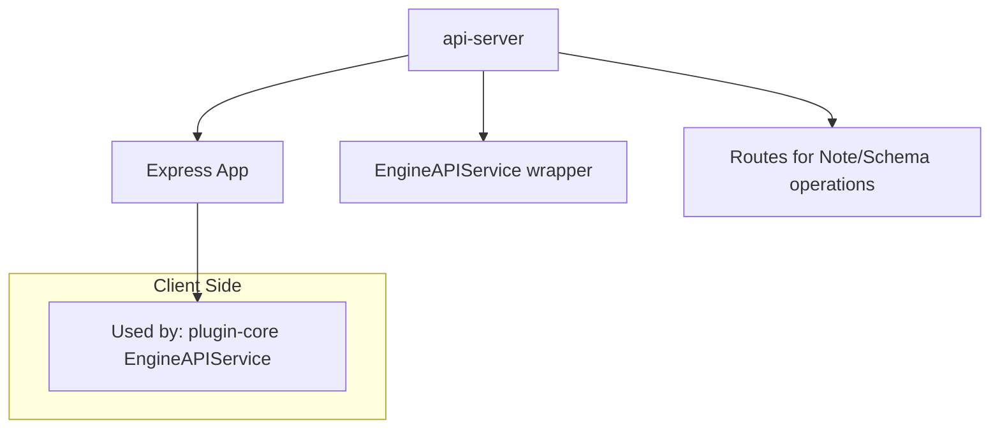
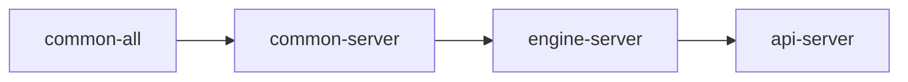

# Package: @dendronhq/api-server

**Status**: HTTP API layer for the Dendron engine. Modernization in progress. Detailed documentation created.

## Table of Contents

- [Overview](#overview)
- [Purpose & Responsibilities](#purpose--responsibilities)
- [Architecture](#architecture)
- [Key Components](#key-components)
- [Internal Dependency Graph](#internal-dependency-graph)
- [External Dependencies](#external-dependencies)
- [Build & Startup](#build--startup)
- [Current Modernization State](#current-modernization-state)
- [Modernization Roadmap](#modernization-roadmap)

---

## Overview

The API server exposes the Dendron engine over HTTP. It allows the VS Code extension (and potentially other clients) to communicate with a separate engine process.

It is the bridge that enables the "engine in separate process" architecture used by Dendron.

---

## Purpose & Responsibilities

- Start an Express server that wraps `DendronEngineV2/V3`.
- Handle JSON-RPC style requests for engine operations.
- Provide health checks and basic server management.
- Support both local development and production usage.

---

## Architecture

---

## Key Components

- `src/index.ts` — `launchv2` function (main entry)
- `src/Server.ts` — Express app setup
- Routes for engine methods (notes, schemas, etc.)

---

## Internal Dependency Graph

---

## External Dependencies

- `express`
- `cors`, `morgan`, `express-async-handler`
- Sentry for error reporting

---

## Build & Startup

Has several start scripts for local dev, integration testing, and debugging.

Clean script updated to pure Node in current modernization pass.

---

## Current Modernization State

| Area              | Status     | Notes |
|-------------------|------------|-------|
| TypeScript        | Modern     | 5.5.4 |
| @types/node       | ^20.12.0   | Good |
| Scripts           | Partially modernized | rimraf removed from clean |
| Documentation     | Created    | This file |

---

## Modernization Roadmap

- [ ] Further review of start scripts for modern Node practices.
- [ ] Consider adding OpenAPI/Swagger spec for the API surface.
- [ ] Participate in broader engine client/server improvements.

---

**Last Updated**: During full one-wave modernization (May 2026)

See master tracker and main plan documents for overall status.