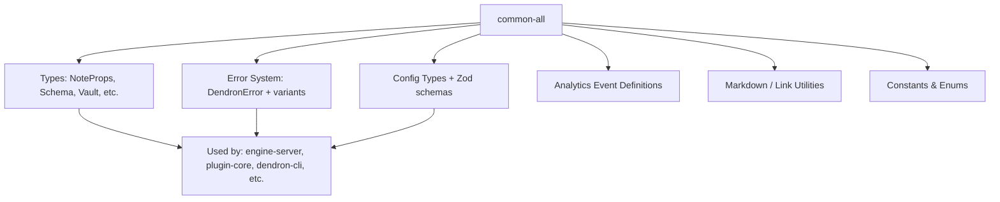
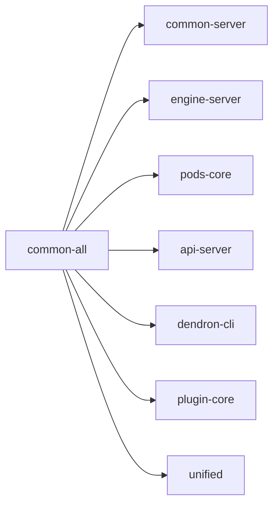

# Package: @dendronhq/common-all

**Status**: Foundational shared library. Modernization baseline established. Detailed documentation created.

## Table of Contents

- [Overview](#overview)
- [Purpose & Responsibilities](#purpose--responsibilities)
- [Architecture](#architecture)
- [Key Modules & Exports](#key-modules--exports)
- [Internal Dependency Graph](#internal-dependency-graph)
- [External Dependencies](#external-dependencies)
- [Build & Compilation](#build--compilation)
- [Current Modernization State](#current-modernization-state)
- [Modernization Roadmap](#modernization-roadmap)
- [Key Files](#key-files)
- [Common Patterns](#common-patterns)

---

## Overview

`@dendronhq/common-all` is the **lowest-level shared library** in the Dendron monorepo. Almost every other package depends on it.

It contains:
- Core domain types (Notes, Schemas, Vaults, etc.)
- Error handling (`DendronError`)
- Configuration types and utilities
- Analytics event definitions
- Markdown-related utilities
- Constants and helpers used across the entire system

It is designed to be **isomorphic** (works in both Node.js and browser environments where possible).

---

## Purpose & Responsibilities

- Define the canonical TypeScript types for Dendron's domain model.
- Provide shared error types and utilities.
- House configuration schema definitions (used by `dendron.yml` validation).
- Define analytics events and types.
- Supply lightweight utilities that have no heavy external dependencies.

---

## Architecture

---

## Key Modules & Exports

| Area                    | Main Files                          | Responsibility |
|-------------------------|-------------------------------------|--------------|
| Core Domain Types       | `dnode.ts`, `note.ts`, `schema.ts` | Note, Schema, Vault, Link definitions |
| Error Handling          | `error.ts`                          | `DendronError`, `IDendronError`, server/client variants |
| Configuration           | `config.ts`                         | `DendronConfig`, publishing, workspace settings types + Zod validation |
| Analytics               | `analytics.ts`, `abTests.ts`        | Event names, properties, A/B test definitions |
| Markdown & Links        | `md.ts`, `parse.ts`                 | Link parsing, reference utilities |
| Utilities               | `helpers.ts`, `assert.ts`, `perf/`  | General helpers, performance timing |

---

## Internal Dependency Graph

`common-all` has **zero** internal Dendron dependencies. It is a pure leaf node.

---

## External Dependencies

Notable external packages:
- `neverthrow` — for `Result` / `ResultAsync` types (functional error handling)
- `zod` — schema validation (especially for config)
- `luxon` — date/time handling
- `fuse.js` — fuzzy search (used in note lookup)
- `github-slugger`, `gray-matter`, `js-yaml`, etc.

Many of these are re-exported or wrapped for convenience.

---

## Build & Compilation

- Uses root `tsconfig.build.json` (extended)
- Outputs to `lib/`
- No special build steps beyond `tsc`
- Published as CommonJS (`lib/index.js`)

Modernization note: As of the current wave, it inherits the modernized root settings (`target: ES2022`, etc.).

---

## Current Modernization State

| Area                        | Status     | Notes |
|-----------------------------|------------|-------|
| TypeScript version          | Modern     | Uses project-wide 5.5.4 |
| @types/node                 | Modern     | ^20.12.0 |
| tsconfig                    | Inherited modern root | No local overrides needed |
| Legacy decorators           | N/A        | Does not use decorators |
| Strict flags                | Partial    | Following root settings |
| Documentation               | **In Progress** | This file created as baseline |

---

## Modernization Roadmap

- [ ] Audit for any remaining old patterns after full monorepo strict mode is enabled.
- [ ] Evaluate removal of older dependencies (e.g., older luxon, fuse.js) if newer major versions are compatible.
- [ ] Contribute to broader effort of replacing `neverthrow` usage if a project-wide decision is made.

---

## Key Files

- `src/index.ts` — Barrel export of almost everything
- `src/error.ts` — Core error system (very widely used)
- `src/config.ts` — Configuration types + Zod schemas
- `src/dnode.ts` — Foundational `DNode` types
- `src/analytics.ts` — Analytics contract

---

## Common Patterns

- Heavy use of branded/nominal types and `neverthrow` `Result` types for error handling.
- Configuration objects are often validated with Zod at runtime.
- Many types are designed to be serializable (for engine <-> client communication).

---

**Last Updated**: During full one-wave modernization effort (May 2026)

**Related Documents**:
- Root TypeScript Upgrade Plan: `09-TYPESCRIPT-UPGRADE-PLAN.md`
- Master Tracker: `MONOREPO-PACKAGES-MODERNIZATION-TRACKER.md`
- Final Modernization Report: `11-FINAL-MODERNIZATION-REPORT.md`