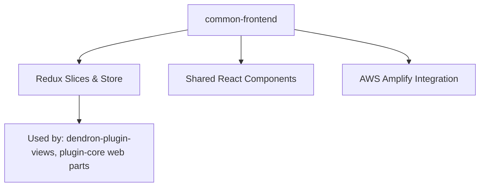
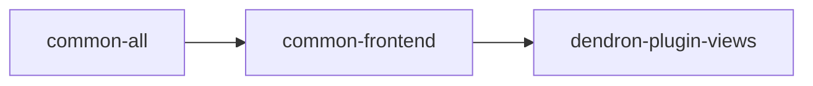

# Package: @dendronhq/common-frontend

**Status**: Shared frontend code (React/Redux). Modernization in progress. Detailed documentation created.

## Table of Contents

- [Overview](#overview)
- [Purpose & Responsibilities](#purpose--responsibilities)
- [Architecture](#architecture)
- [Key Components](#key-components)
- [Internal Dependency Graph](#internal-dependency-graph)
- [External Dependencies](#external-dependencies)
- [Build & Compilation](#build--compilation)
- [Current Modernization State](#current-modernization-state)
- [Modernization Roadmap](#modernization-roadmap)

---

## Overview

This package contains shared React components, Redux slices, and frontend utilities used by `dendron-plugin-views` and parts of the VS Code extension webviews.

It has a `nohoist` for `common-all` due to React compatibility needs.

---

## Purpose & Responsibilities

- Provide reusable UI primitives and state management for Dendron's web interfaces
- Share Redux logic between the webviews package and extension
- Abstract common patterns for notes, vaults, and publishing UI

---

## Architecture

---

## Key Components

- Redux toolkit slices for notes, config, etc.
- Common UI components (some may be moving to design-system)
- Amplify auth/config helpers

---

## Internal Dependency Graph

---

## External Dependencies

- React 17
- Redux Toolkit
- AWS Amplify
- lodash, etc.

---

## Build & Compilation

- Has custom tsconfig overrides for JSX and DOM libs
- Compiles cleanly
- Scripts modernized (rimraf removed)

---

## Current Modernization State

| Area              | Status     | Notes |
|-------------------|------------|-------|
| TypeScript        | Modern     | 5.5.4 |
| @types/node       | ^20.12.0   | Good |
| Scripts           | Modernized | - |
| Documentation     | **Created** | This file |

---

## Modernization Roadmap

- [ ] Evaluate upgrade to React 18 in coordination with plugin-views
- [ ] Align with any future design system consolidation
- [ ] Participate in stricter TS flag rollout

---

**Last Updated**: During full one-wave modernization (May 2026)

See master tracker for overall progress.