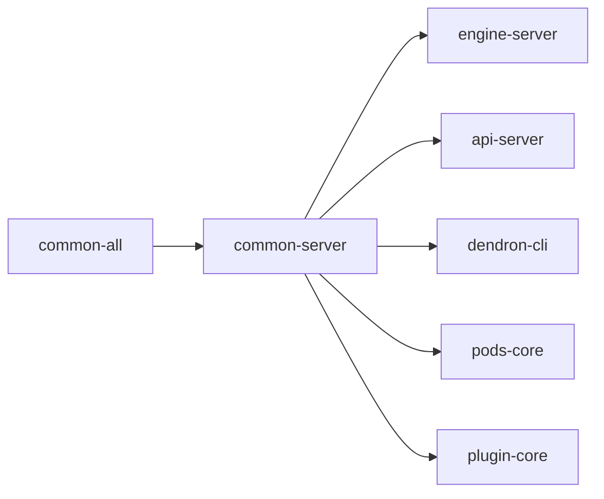

# Package: @dendronhq/common-server

**Status**: Core server-side utilities. Modernization in progress. Detailed documentation created.

## Table of Contents

- [Overview](#overview)
- [Purpose & Responsibilities](#purpose--responsibilities)
- [Architecture](#architecture)
- [Key Modules](#key-modules)
- [Internal Dependency Graph](#internal-dependency-graph)
- [External Dependencies](#external-dependencies)
- [Build & Compilation](#build--compilation)
- [Current Modernization State](#current-modernization-state)
- [Modernization Roadmap](#modernization-roadmap)
- [Key Files](#key-files)
- [Common Patterns](#common-patterns)

---

## Overview

`@dendronhq/common-server` provides server-side (Node.js) utilities that are shared across the Dendron engine, CLI, API server, and other backend components.

It sits directly above `common-all` in the dependency hierarchy and contains:
- File system utilities
- Logging (Pino)
- Git operations
- Configuration reading/writing
- Error reporting (Sentry)
- Analytics
- Various helpers for vaults, notes, and publishing

---

## Purpose & Responsibilities

- Provide robust, reusable Node.js utilities.
- Handle file I/O, YAML/JSON parsing, and git interactions safely.
- Centralize logging and error reporting infrastructure.
- Support workspace and vault management operations.
- Enable analytics and telemetry for server-side code.

---

## Architecture

```mermaid
graph TD
    A[common-server] --> B[File System Utilities]
    A --> C[Logging (Pino)]
    A --> D[Git Integration]
    A --> E[Config Management]
    A --> F[Error Reporting (Sentry)]
    A --> G[Analytics]
    A --> H[Vault & Workspace Helpers]

    B --> I[Used by: engine-server, dendron-cli, api-server, pods-core]
    C --> I
    D --> I
    E --> I
```

---

## Key Modules

| Area                    | Notable Files                          | Responsibility |
|-------------------------|----------------------------------------|--------------|
| File System             | `filesv2.ts`, `files.ts`               | Reading/writing notes, schemas, YAML, frontmatter |
| Logging                 | `logger.ts`, pino wrappers             | Structured logging with pino + pretty printing |
| Git                     | `git.ts`, `simple-git` wrappers        | Git operations for vaults |
| Configuration           | `DConfig.ts`, config reading           | Reading/writing dendron.yml and local overrides |
| Error Reporting         | Sentry integration                     | Production error tracking |
| Analytics               | `analytics.ts`                         | Segment analytics client |
| Vault Management        | `workspace/` directory                 | Vault initialization, git sync helpers |

---

## Internal Dependency Graph



---

## External Dependencies

Notable ones:
- `pino` + `pino-pretty` (logging)
- `simple-git` (git)
- `fs-extra`
- `execa`
- `@sentry/node`
- `analytics-node`
- `gray-matter`, `js-yaml`, `comment-json`
- `tmp`, `anymatch`, `textextensions`

---

## Build & Compilation

- Extends root `tsconfig.build.json`
- Outputs to `lib/`
- Currently compiles cleanly under the modernized root settings (TS 5.5.4, ES2022 target, etc.).

---

## Current Modernization State

| Area                        | Status          | Notes |
|-----------------------------|-----------------|-------|
| TypeScript                  | Modern (5.5.4)  | Inherits root |
| @types/node                 | ^20.12.0        | Good |
| Scripts                     | Partially modernized | Clean script updated to pure Node (rimraf removed) |
| Dead dev deps               | Partially cleaned | tslint, coveralls, old ts-node, old rimraf removed |
| Strict flags                | Following root  | Additional strictness possible |
| Documentation               | **Created**     | This file + architecture diagrams |

---

## Modernization Roadmap

- [ ] Full cleanup of remaining old dev dependencies if unused.
- [ ] Evaluate pino and analytics-node for any major version upgrades.
- [ ] Contribute to monorepo-wide effort to modernize or replace legacy git + file handling patterns.
- [ ] Participate in decorator/DI modernization if any server-side DI is introduced later.

---

## Key Files

- `src/filesv2.ts` — Core file reading/writing logic
- `src/logger.ts` — Logging setup
- `src/DConfig.ts` — Configuration handling (pairs with common-all)
- `src/workspace/service.ts` — Workspace and vault management
- `src/git.ts` — Git utilities

---

## Common Patterns

- Heavy use of `fs-extra` for robust file operations.
- Pino for structured, high-performance logging.
- Consistent use of `DendronError` from `common-all`.
- Many functions accept `wsRoot` and work relative to a Dendron workspace.

---

**Last Updated**: During full one-wave modernization effort (May 2026)

**Related Documents**:
- Master Tracker: `MONOREPO-PACKAGES-MODERNIZATION-TRACKER.md`
- TypeScript Upgrade Plan: `09-TYPESCRIPT-UPGRADE-PLAN.md`
- Final Report: `11-FINAL-MODERNIZATION-REPORT.md`