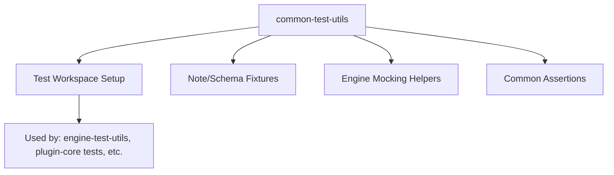
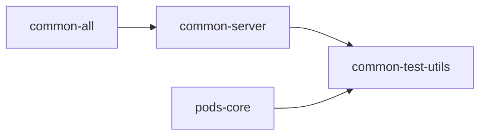

# Package: @dendronhq/common-test-utils

**Status**: Testing utilities for the monorepo. Modernization complete for this pass. Detailed documentation created.

## Table of Contents

- [Overview](#overview)
- [Purpose & Responsibilities](#purpose--responsibilities)
- [Architecture](#architecture)
- [Key Utilities](#key-utilities)
- [Internal Dependency Graph](#internal-dependency-graph)
- [External Dependencies](#external-dependencies)
- [Build & Compilation](#build--compilation)
- [Current Modernization State](#current-modernization-state)
- [Modernization Roadmap](#modernization-roadmap)
- [Key Files](#key-files)

---

## Overview

This package provides shared testing helpers, fixtures, and utilities used across unit and integration tests in the Dendron monorepo. It is private and not published.

It builds on `common-all`, `common-server`, and `pods-core` to make writing tests easier.

---

## Purpose & Responsibilities

- Provide test workspace setup helpers (e.g., creating temporary Dendron vaults)
- Offer assertion utilities and mock factories
- Standardize test patterns for notes, schemas, and engine interactions
- Support both Jest and other test runners used in the project

---

## Architecture

---

## Key Utilities

- Workspace creation helpers (self-contained vaults, multi-vault setups)
- Note creation factories with frontmatter and links
- Mock engine and service providers
- Test data generators

---

## Internal Dependency Graph

---

## External Dependencies

- `fs-extra`
- `lodash`
- `sinon`
- `jest`
- `@types/sinon`

---

## Build & Compilation

- Uses `tsconfig.json` (slightly different from .build in some cases)
- Compiles cleanly on modern TS 5.5.4 + @types/node ^20
- Scripts updated: rimraf removed, ts-node updated

---

## Current Modernization State

| Area              | Status     | Notes |
|-------------------|------------|-------|
| TypeScript        | Modern (5.5.4) | Good |
| @types/node       | ^20.12.0   | Good |
| Scripts           | Modernized | rimraf + old ts-node cleaned |
| Documentation     | **Created** | This file with TOC + Mermaid |

---

## Modernization Roadmap

- [ ] Further integration with stricter tsconfig flags from root (noUncheckedIndexedAccess, etc.)
- [ ] Expand fixtures for new features as the project modernizes
- [ ] Contribute to any future test framework consolidation

---

## Key Files

- `src/testUtilsv2.ts` / `src/testUtilsV3.ts` — Main test helpers
- `src/utils/` — Workspace and note creation utilities
- Various preset and mock files

---

**Last Updated**: During full one-wave modernization effort (May 2026)

See `MONOREPO-PACKAGES-MODERNIZATION-TRACKER.md` for overall progress across all packages.