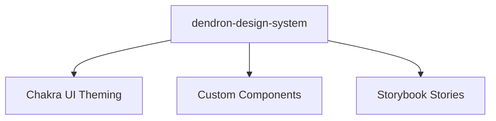

# Package: @dendronhq/dendron-design-system

**Status**: Design system based on Chakra UI. Documentation created. TS already modern.

## Table of Contents

- [Overview](#overview)
- [Purpose](#purpose)
- [Architecture](#architecture)
- [Modernization State](#modernization-state)

---

## Overview

Provides a consistent design system and component library for Dendron's web interfaces (used by plugin-views and publishing).

Built on Chakra UI, Emotion, and Framer Motion.

---

## Purpose

- Centralize UI components and theming
- Ensure consistent look and feel across web experiences
- Support Storybook for component development

---

## Architecture

---

## Modernization State

- TypeScript already updated to ^5.5.4 in previous waves
- Detailed documentation created
- Further review of UI library versions (Chakra 1.x is older) recommended as part of broader frontend modernization

---

**Last Updated**: During full one-wave modernization (May 2026)

See master tracker.