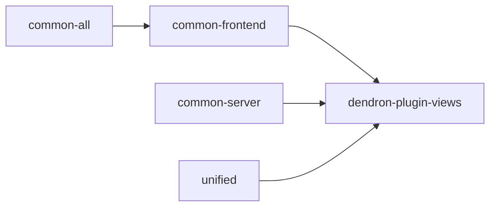

# Package: @dendronhq/dendron-plugin-views

**Status**: React webviews for the VS Code extension. One of the most complex packages. Documentation created. Scripts partially modernized.

## Table of Contents

- [Overview](#overview)
- [Purpose & Responsibilities](#purpose--responsibilities)
- [Architecture](#architecture)
- [Key Technologies](#key-technologies)
- [Internal Dependency Graph](#internal-dependency-graph)
- [Build System](#build-system)
- [Current Modernization State](#current-modernization-state)
- [Modernization Roadmap](#modernization-roadmap)
- [Challenges](#challenges)

---

## Overview

This is the React application that powers all the webviews in the Dendron VS Code extension (Graph, Preview, Lookup, Calendar, Tip of the Day, etc.).

It is a full webpack-based React app (Create React App style with heavy customization) that communicates with the extension host via `postMessage`.

---

## Purpose & Responsibilities

- Render all interactive UI for the extension (sidebar panels and editor webviews)
- Handle rich visualizations (Cytoscape graph, rich markdown preview)
- Provide the "Dendron experience" inside VS Code without native UI limitations

---

## Architecture

```mermaid
graph TD
    A[dendron-plugin-views] --> B[React App (multiple "apps" for different webviews)]
    A --> C[Webpack Build (dev + prod)]
    A --> D[Communication Layer (postMessage with DMessage protocol)]
    B --> E[Graph View, Preview, Lookup, etc.]
    C --> F[Output consumed by plugin-core WebViewUtils]
```

The package builds static assets that are served into VS Code webviews.

---

## Key Technologies

- React 17 + TypeScript
- Ant Design (antd)
- Cytoscape.js for graphs
- Heavy remark/rehype pipeline for preview (shared with unified/engine)
- Webpack 4/5 custom config

---

## Internal Dependency Graph



---

## Build System

Complex webpack configuration with:
- Multiple entry points for different webviews
- React Refresh for dev
- Asset copying and optimization
- Special handling for the extension host environment

---

## Current Modernization State

| Area                    | Status          | Notes |
|-------------------------|-----------------|-------|
| TypeScript              | Modern (5.5.4)  | Good |
| @types/node             | ^20.12.0        | Good |
| Scripts                 | Partially modernized | Clean script updated (removed rimraf) |
| Webpack / CRA setup     | Legacy          | Heavy customization; major refactor needed for full modernization |
| Documentation           | **Created**     | This file (high-level due to complexity) |

---

## Modernization Roadmap

- [ ] Major webpack / build system refresh (consider Vite or modern CRA equivalent)
- [ ] React 18 upgrade (coordinated with common-frontend)
- [ ] Better tree-shaking and bundle size optimization
- [ ] Full integration with any future design system v2
- [ ] Address any remaining node_modules type issues from @types/node 20 bump

---

## Challenges

This is one of the hardest packages to modernize due to:
- Deep webpack customization
- Dual environment (browser + VS Code webview constraints)
- Large number of UI dependencies
- Tight coupling with the extension host communication protocol

It will likely require a dedicated multi-week effort in a future phase.

---

**Last Updated**: During full one-wave modernization (May 2026)

See master tracker and main plan for overall status and the big picture.