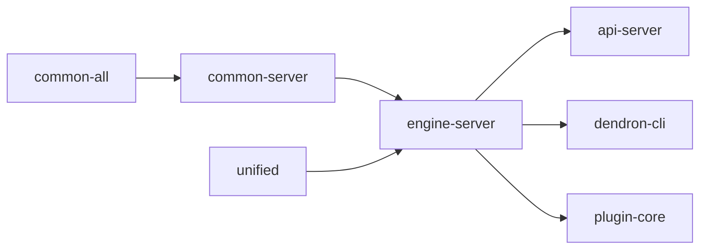

# Package: @dendronhq/engine-server

**Status**: Core Dendron engine implementation. Modernization in progress. Detailed documentation created.

## Table of Contents

- [Overview](#overview)
- [Purpose & Responsibilities](#purpose--responsibilities)
- [Architecture](#architecture)
- [Key Subsystems](#key-subsystems)
- [Internal Dependency Graph](#internal-dependency-graph)
- [External Dependencies](#external-dependencies)
- [Build Process](#build-process)
- [Current Modernization State](#current-modernization-state)
- [Modernization Roadmap](#modernization-roadmap)
- [Key Files & Directories](#key-files--directories)

---

## Overview

`@dendronhq/engine-server` is the heart of Dendron. It implements `DendronEngineV2` / `DendronEngineV3`, the note indexing system, schema handling, and the backend logic that both the CLI and VS Code extension talk to (usually over the API server or in-process).

It is one of the most complex packages in the monorepo.

---

## Purpose & Responsibilities

- Parse and index notes + schemas from the file system.
- Maintain the in-memory note and schema stores.
- Provide the core `DEngine` interface implementation.
- Handle note operations (create, update, delete, move, rename).
- Manage backlinks, references, and hierarchy.
- Integrate with SQLite via Prisma for metadata.
- Support both in-process and remote (HTTP) usage.

---

## Architecture

```mermaid
graph TD
    A[engine-server] --> B[DendronEngineV2 / V3]
    A --> C[NoteParser + SchemaParser]
    A --> D[Store Layer (drivers/file)]
    A --> E[SQLite + Prisma Metadata]
    A --> F[WorkspaceService]
    A --> G[Git + Sync Utilities]

    B --> H[Used by: api-server, dendron-cli, plugin-core via EngineAPIService]
    C --> H
    D --> H
```

---

## Key Subsystems

- **Engine Core**: `DendronEngineV2.ts`, `DendronEngineV3.ts`
- **Parsing**: `drivers/file/NoteParserV2.ts`, schema parsers
- **Storage**: `drivers/file/storev2.ts`, Prisma client
- **Services**: `workspace/service.ts`, `doctor/`, `seed/`
- **Unified Pipeline**: Heavy integration with remark/rehype plugins for publishing and preview

---

## Internal Dependency Graph



---

## External Dependencies

Notable:
- Large remark/rehype ecosystem (many remark-* and rehype-* packages)
- `sqlite3` + `@prisma/client`
- `chokidar` (file watching)
- `execa`, `fs-extra`, `simple-git`
- `fuse.js` (via common-all), `gray-matter`, etc.

---

## Build Process

Special steps:
- `yarn buildPrismaClient` — Generates Prisma client and copies it.
- The `drivers/generated-prisma-client` directory is generated.

Clean script removes the generated Prisma client.

---

## Current Modernization State

| Area                        | Status          | Notes |
|-----------------------------|-----------------|-------|
| TypeScript                  | Modern (5.5.4)  | Good |
| @types/node                 | ^20.12.0        | Good |
| Scripts                     | Partially modernized | Clean script updated |
| Prisma / Native modules     | Present         | Requires special build step |
| Strict flags                | Following root  | - |
| Documentation               | **Created**     | This file |

---

## Modernization Roadmap

- [ ] Further cleanup of remark/rehype dependency versions.
- [ ] Evaluate Prisma + SQLite usage for potential modernization.
- [ ] Participate in broader decorator/DI cleanup if any engine-side DI exists.
- [ ] Improve build reliability around the generated Prisma client.

---

## Key Files & Directories

- `src/enginev2.ts` / `src/DendronEngineV3.ts`
- `src/drivers/file/`
- `src/workspace/service.ts`
- `src/drivers/generated-prisma-client/` (generated)
- `src/doctor/`, `src/seed/`

---

**Last Updated**: During full one-wave modernization effort (May 2026)

**Related Documents**:
- Master Tracker, 09-Plan, 11-Report (see root docs/dev)