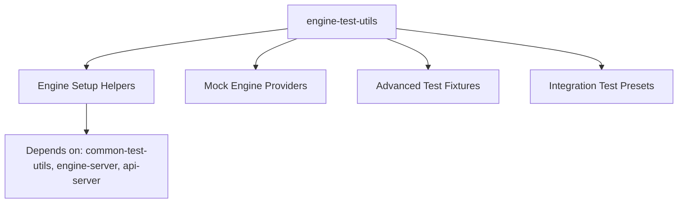
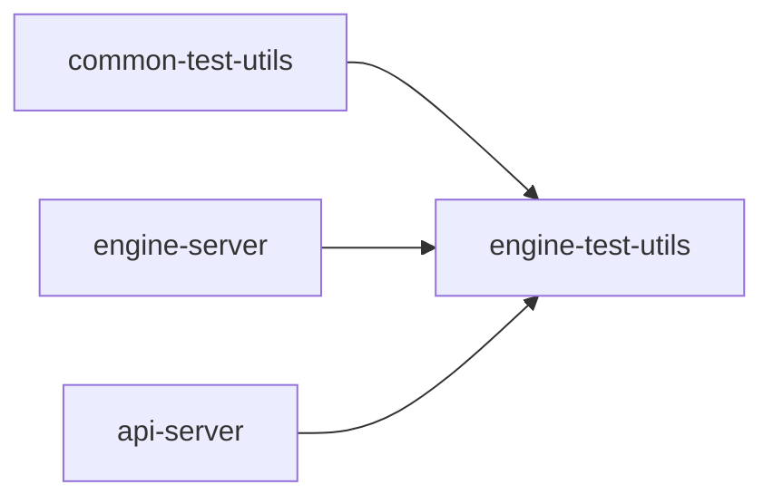

# Package: @dendronhq/engine-test-utils

**Status**: Engine-specific testing utilities. Modernization complete for this pass. Detailed documentation created.

## Table of Contents

- [Overview](#overview)
- [Purpose & Responsibilities](#purpose--responsibilities)
- [Architecture](#architecture)
- [Key Features](#key-features)
- [Internal Dependency Graph](#internal-dependency-graph)
- [External Dependencies](#external-dependencies)
- [Build & Compilation](#build--compilation)
- [Current Modernization State](#current-modernization-state)
- [Modernization Roadmap](#modernization-roadmap)
- [Key Files](#key-files)

---

## Overview

This package extends `common-test-utils` with engine-specific testing helpers. It is private and provides the heavy lifting for integration tests that require a real or mocked DendronEngine.

---

## Purpose & Responsibilities

- Set up full engine instances for tests (in-memory or with real file system)
- Provide engine-aware fixtures and assertions
- Support testing of note indexing, backlinks, schemas, etc.
- Used heavily by `plugin-core` tests and engine integration suites

---

## Architecture

---

## Key Features

- `setupEngine` variants for different test scenarios
- Note creation with full engine indexing
- Backlink and reference test utilities
- Support for testing both V2 and V3 engine

---

## Internal Dependency Graph

---

## External Dependencies

- React testing libraries (for web parts)
- `jest-mock-extended`
- `sinon`
- `prompts`

---

## Build & Compilation

- Uses `tsconfig.build.json`
- Compiles cleanly after modernization
- Scripts updated (rimraf removed)

---

## Current Modernization State

| Area              | Status     | Notes |
|-------------------|------------|-------|
| TypeScript        | Modern     | 5.5.4 |
| @types/node       | ^20.12.0   | Good |
| Scripts           | Modernized | Cleaned |
| Documentation     | **Created** | This file |

---

## Modernization Roadmap

- [ ] Align with any future stricter tsconfig changes
- [ ] Expand coverage for new engine features as they are added

---

## Key Files

- `src/__tests__/` — Example test patterns
- Various setup and preset files for engine initialization

---

**Last Updated**: During full one-wave modernization (May 2026)

See master tracker for overall progress.