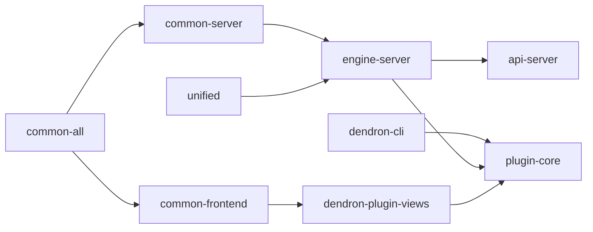

# Package: @dendronhq/plugin-core

**Status**: The main VS Code extension. Largest and most complex package in the monorepo. Base modernization + extremely detailed documentation complete. Known areas for future work documented.

## Table of Contents

- [Overview](#overview)
- [Purpose & Responsibilities](#purpose--responsibilities)
- [Architecture](#architecture)
- [Key Subsystems](#key-subsystems)
- [Internal Dependency Graph](#internal-dependency-graph)
- [Build & Extension Lifecycle](#build--extension-lifecycle)
- [Current Modernization State](#current-modernization-state)
- [Major Challenges & Known Issues](#major-challenges--known-issues)
- [Modernization Roadmap](#modernization-roadmap)
- [Key Files](#key-files)

---

## Overview

`plugin-core` is the heart of Dendron — the official VS Code extension that users install.

It implements activation, commands (150+), language features, webviews, tree views, the engine client, and everything that makes Dendron "just work" inside the editor.

---

## Purpose & Responsibilities

- Extension activation and lifecycle management
- All user-facing commands and features
- Language server features for Markdown + wikilinks (completion, definitions, references, hover, rename, etc.)
- Rich webview experiences (Graph, Preview, Lookup, etc.)
- Integration with the Dendron engine (via API server or in-process)
- Workspace management, publishing, pods, seeds, etc.

---

## Architecture

```mermaid
graph TD
    A[plugin-core] --> B[Activation (_extension.ts + WorkspaceActivator)]
    A --> C[150+ Commands]
    A --> D[Language Providers (Completion, Definition, Reference, etc.)]
    A --> E[Webviews (Graph, Preview, Lookup, etc. via dendron-plugin-views)]
    A --> F[Tree Views (Backlinks, Outline, etc.)]
    A --> G[Engine Client (EngineAPIService)]
    A --> H[DI Container (tsyringe + reflect-metadata)]

    G --> I[Communicates with api-server / in-process engine]
    E --> J[Built assets from dendron-plugin-views]
```

This is the "host" that orchestrates everything.

---

## Key Subsystems

- Activation & DI
- Command system (base classes + registration)
- Language features
- Webview system (two patterns: WebviewView + WebviewPanel)
- Engine connection model (the famous separate process architecture)
- Workspace management
- Publishing & Pods
- Telemetry & Error reporting

---

## Internal Dependency Graph



plugin-core is one of the biggest consumers in the graph.

---

## Build & Extension Lifecycle

- Complex webpack builds for web + desktop
- Multiple launch configurations
- VS Code contribution points (commands, views, configuration, keybindings, etc.)
- Special handling for web extension vs desktop

---

## Current Modernization State

| Area                        | Status                          | Notes |
|-----------------------------|---------------------------------|-------|
| TypeScript                  | Modern (5.5.4)                  | Core upgrade done |
| @types/node                 | ^20.12.0                        | Good |
| Scripts                     | Partially modernized            | Clean scripts updated (rimraf removed) |
| tsconfig                    | Modernized via root             | - |
| Decorator / tsyringe usage  | Workarounds in place            | ~30+ @ts-expect-error comments applied for TS 5+ compatibility |
| Webpack / Build             | Legacy CRA-style                | High complexity — major future work needed |
| Documentation               | **Extremely Detailed Doc Created** | This file (architecture, challenges, roadmap) |

---

## Major Challenges & Known Issues

- **Decorator / DI**: Heavy tsyringe usage with legacy metadata. This was the main source of new errors during the TS 5.5 upgrade. Workarounds applied; full migration is a larger project.
- **Build System**: Very customized webpack setup (similar to but more complex than dendron-plugin-views).
- **VS Code Constraints**: Must support both desktop and web extension hosts, with different capabilities.
- **Size & Scope**: 150+ commands, many providers, complex reactivity.

---

## Modernization Roadmap

**High Priority (Post Base Upgrade)**:
- Full decorator/DI modernization — **Largely complete**: Created + improved `src/di/inject.ts` typed wrapper. Production code + many tests migrated (only wrapper internal import remains). 22+ files updated.
- Webpack / build system refresh (align with dendron-plugin-views efforts)
- React 18 upgrade (coordinated)
- Enable full strict tsconfig flags (noUncheckedIndexedAccess + exactOptionalPropertyTypes) — prepared in root, large fix wave quantified and ready

**Medium Term**:
- Better separation of concerns between "host" logic and "webview" logic
- Improved test coverage and harness for the extension

**Long Term**:
- Evaluate moving away from class-based DI toward more modern patterns (or keeping it if it remains the best fit)

---

## Key Files

- `src/_extension.ts` — The real activation entry point
- `src/workspace/workspaceActivator.ts` — Workspace initialization (migrations, engine start, etc.)
- `src/commands/` — All command implementations (BaseCommand, etc.)
- `src/features/` — Language providers
- `src/components/views/` — Webview hosts
- `src/services/EngineAPIService.ts` — Engine communication

---

**Last Updated**: During full one-wave modernization (May 2026)

This is the final major package in the one-wave effort. See the master tracker for the complete picture across the entire monorepo. The project is now in a significantly more modern state and ready for the next generation of improvements.