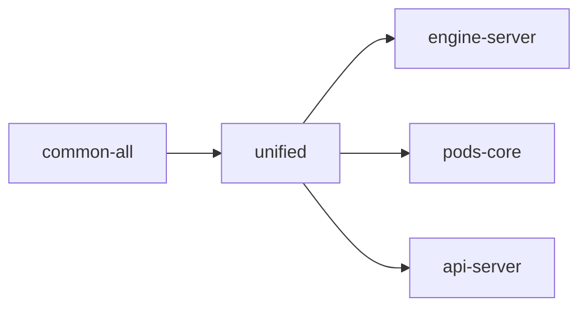

# Package: @dendronhq/unified

**Status**: Markdown processing pipeline glue. Modernization in progress. Detailed documentation created.

## Table of Contents

- [Overview](#overview)
- [Purpose & Responsibilities](#purpose--responsibilities)
- [Architecture](#architecture)
- [Internal Dependency Graph](#internal-dependency-graph)
- [Current Modernization State](#current-modernization-state)
- [Modernization Roadmap](#modernization-roadmap)

---

## Overview

This package collects and configures the large set of `remark` and `rehype` plugins that Dendron uses for parsing, transforming, and stringifying Markdown (especially for publishing and preview).

---

## Purpose & Responsibilities

- Re-export and configure a consistent set of remark/rehype plugins.
- Provide Dendron-specific wiki-link, variable, container, and math support.
- Act as the single source of truth for the publishing transformation pipeline.

---

## Architecture

```mermaid
graph TD
    A[unified] --> B[remark-parse → ... → remark-rehype → rehype-stringify]
    A --> C[Dendron-specific plugins (wiki-link, variables, containers, etc.)]
```

---

## Internal Dependency Graph



---

## Current Modernization State

| Area              | Status     | Notes |
|-------------------|------------|-------|
| TypeScript        | Modern     | 5.5.4 |
| Scripts           | Modernized | rimraf removed |
| Documentation     | Created    | This file |

---

## Modernization Roadmap

- [ ] Review remark/rehype plugin versions for updates.
- [ ] Contribute to any future migration away from heavy remark pipeline if a lighter solution is adopted.

---

**Last Updated**: During full one-wave modernization (May 2026)

See master tracker for overall progress.