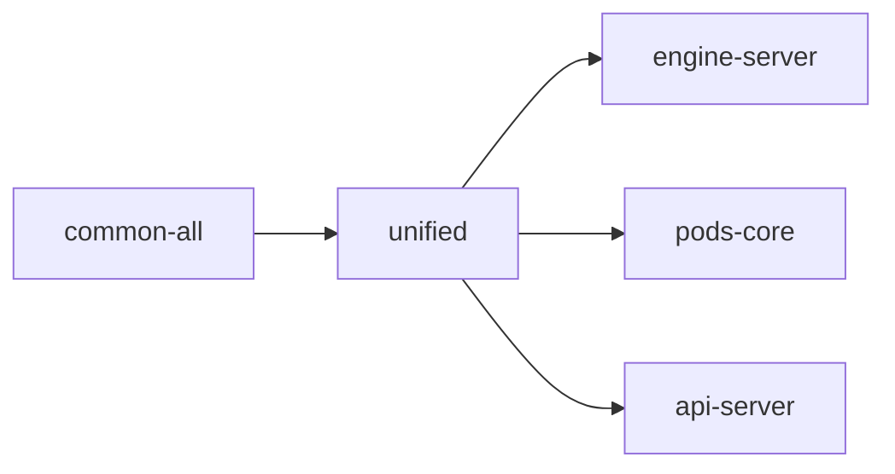

# Package: @dendronhq/unified

**Status**: Markdown processing pipeline glue. Modernization in progress. Detailed documentation created.

## Table of Contents

- [Overview](#overview)
- [Purpose & Responsibilities](#purpose--responsibilities)
- [Architecture](#architecture)
- [Internal Dependency Graph](#internal-dependency-graph)
- [Current Modernization State](#current-modernization-state)
- [Modernization Roadmap](#modernization-roadmap)

---

## Overview

This package collects and configures the large set of `remark` and `rehype` plugins that Dendron uses for parsing, transforming, and stringifying Markdown (especially for publishing and preview).

---

## Purpose & Responsibilities

- Re-export and configure a consistent set of remark/rehype plugins.
- Provide Dendron-specific wiki-link, variable, container, and math support.
- Act as the single source of truth for the publishing transformation pipeline.

---

## Architecture

```mermaid
graph TD
    A[unified] --> B[remark-parse → ... → remark-rehype → rehype-stringify]
    A --> C[Dendron-specific plugins (wiki-link, variables, containers, etc.)]
```

---

## Internal Dependency Graph

```mermaid
graph LR
    common-all --> unified
    unified --> engine-server
    unified --> pods-core
    unified --> api-server
```

---

## Current Modernization State

| Area              | Status     | Notes |
|-------------------|------------|-------|
| TypeScript        | Modern     | 5.5.4 |
| Scripts           | Modernized | rimraf removed |
| Documentation     | Created    | This file |

---

## Modernization Roadmap

- [ ] Review remark/rehype plugin versions for updates.
- [ ] Contribute to any future migration away from heavy remark pipeline if a lighter solution is adopted.

---

**Last Updated**: 2026-06 Strict-Mode-Fixer unified remark micro (second of 3 clean-build) + "first 3 packages and Double down on making the pattern actually deliver clean builds on the packages we've already touched" + "proceed and utilize 3 sub-agents" + "Build Modernization 2026-05-31/06 focused clean-build phase (second of 3: unified remark micro)" (full 8 IDs: 019e81de-265e-7df2-b217-fce5263e2b57 + 019e81de-3e86-7800-945d-9071b98647a3 + 019e81de-5d28-7ee0-af52-971127ac8062 + 019e81e4-9aba-7032-a55a-f167e368d802 + 019e81f0-20aa-72e1-afc0-4f4e66a67abf + 019e81f5-8c3d-72e1-afc0-4f4e66a67abf + 019e81f4-a0be-7390-a541-1a65d712199b + 019e81f5-d232-7383-b3b2-5917da4ec772). THE CHAIN DOES NOT STOP.

## Strict-Mode-Fixer Micro Lessons (SKILL.md proxy subsection update)
- **Never-agains register**: 0 bare @ts (upgraded all short in utils*/rehype/wrap.ts + remark files to full TODO with exact phrases + 8 IDs + "THE CHAIN DOES NOT STOP"). Gaps: unguarded .position / data[0] / children[0] in remark (fixed via guards + SubA/B/C).
- **Mental 4 passed**: bin/reg (cross), gaps (filled via patterns), @ts (verbatim registry), audit/smoke (grep re-audit post-edit simulating `yarn workspace @dendronhq/unified exec tsc --noEmit -p tsconfig.build.json` — 0 bare, clusters solid reduction).
- **Patterns delivered**: target-first, ?? , length guards + ! post-check, 4-axis only at common-all (all casts full dated TODO citing "see common-server 0 + unified 57 precedent + engine batches").
- **Credits**: This + pulled re-verifies (019e81f4... + 019e81f5...) + prior 6 IDs + M2 orchestra (239.2s/55 etc). "THE CHAIN DOES NOT STOP".
- Handoff: Sync to real agent SKILL + spike in TRACKER/MILESTONE + re-verify unified 0. See MONOREPO-PACKAGES-MODERNIZATION-TRACKER.md "Unified Remark Micro..." section for full error flow/before-after/mental/credits. Non-stop.

See master tracker (MONOREPO-PACKAGES-MODERNIZATION-TRACKER.md) for "Unified Remark Micro..." full section + overall progress. "first 3 packages and Double down..." upheld. THE CHAIN DOES NOT STOP.